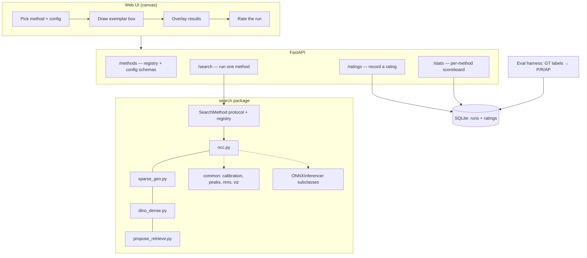

# Object Search Exploration — Project Brief

> **Purpose of this document:** input to `/gsd-new-project --auto @.planning/IDEA.md`.
> It defines what to build, the constraints, the phase structure, and which installed
> Claude skills govern each phase. GSD will expand this into `PROJECT.md`,
> `REQUIREMENTS.md`, and `ROADMAP.md`.

---

## 1. What This Is

An interactive **exemplar-based object search demo**: the user draws a box around one
object in an image, and the system finds **every other instance of that same object in
that same image**. Four independent search methods are implemented behind one interface,
selectable before the box is drawn, so the same query can be run through different
algorithms and compared.

A rating layer records how well each method did on each query, and a statistics layer
turns those ratings — plus objective metrics on ground-truthed images — into a
per-method scoreboard.

This is an **exploration harness**, not a product. Its value is that each method is
readable, editable, and measurable by an ML practitioner, and that adding a fifth method
or a whole new exploration is a small, obvious diff.

## 2. Core Value

Given one hand-drawn exemplar box, return all matching instances in the image — through
any of four interchangeable methods — and accumulate enough evidence (subjective ratings
plus objective precision/recall) to say which method actually works, on which kind of
image, and at what latency.

## 3. Primary User

A machine-learning practitioner (the repo owner) who will **read and edit the method
code directly**. This drives two non-negotiable design constraints:

1. **Each method is one self-contained, top-to-bottom readable Python module.** The full
   algorithm is visible in one file, with numbered step comments matching the
   documentation. Shared helpers are imported explicitly and are never required — a
   method may inline its own variant if that reads better.
2. **No hidden control flow.** No plugin magic, no deep inheritance chains, no
   config-driven dispatch inside a method. One registry decorator per method is the only
   indirection.

## 4. Non-Goals (Milestone 1)

- Cross-image / corpus search — search is confined to a single image. (The Phase 7
  embedding store is designed so corpus search is a later addition, not a rewrite.)
- Training or fine-tuning any model. All models are pretrained and frozen.
- Video / temporal search.
- Segmentation masks as the primary output — boxes are the output contract. (Method 6
  from research is deferred; see §12.)
- Multi-user auth, deployment, or scaling. Local single-user demo.
- Real-time performance guarantees. Latency is *measured*, not *guaranteed*.

---

## 5. The Four Methods

Numbering follows the source research so documentation and code stay aligned with it.
Methods 4 and 6 from the research are deliberately deferred (§12).

### Method 1 — NCC Template Matching (`ncc`)

Zero-model baseline. `cv2.matchTemplate` with `TM_CCOEFF_NORMED`, then peak extraction
and NMS over the response map.

- **Scale invariance:** image pyramid; take the max response across levels, keeping the
  level index per peak so the output box size is correct.
- **Rotation invariance:** rotated-template bank (configurable angle set, default
  `[0]` — off by default because it is a large constant-factor cost).
- **Why it is here:** when instances are near-identical and near the same scale, this is
  genuinely hard to beat, and it costs milliseconds with no weights. It is the honest
  baseline every learned method must clear.
- **Robustness backlog:** FFT-based correlation for large templates; log-polar /
  Fourier–Mellin for joint rotation-scale invariance; discriminative correlation filters
  (MOSSE/KCF) trained on the single crop to suppress background rather than correlate
  raw pixels.

### Method 2 — Sparse Features + Multi-Model Geometric Verification (`sparse-geo`)

Keypoints on the crop, matched into the scene, then **many** geometric models recovered
rather than one.

Two interchangeable feature backends behind one interface:
- **Classical:** OpenCV SIFT / AKAZE / ORB. No weights, no ONNX, ships first.
- **Learned:** **SuperPoint via ONNX Runtime** (export tooling is mature —
  `fabio-sim/LightGlue-ONNX` exports SuperPoint standalone).

**This resolves the open question in the source research.** The research flagged that
LightGlue/SuperGlue assume roughly one-to-one assignment, which is exactly wrong for
repeated instances, and asked whether to run LightGlue sequentially or switch to LoFTR.
**Neither is needed.** The design is:

1. Detect + describe keypoints on the crop and on the full scene (same backend).
2. For each crop keypoint, take its **top-k scene neighbours** (k ≈ 5–10) by descriptor
   distance. Many-to-many by construction — no assignment step, so nothing to defeat.
3. Each correspondence votes in a 4-DoF similarity pose space `(Δx, Δy, log s, θ)` —
   generalized Hough voting. Bin and find peaks.
4. Per peak: RANSAC a similarity/affine model using only that peak's correspondences.
   Accept if inlier count clears a threshold and the transformed crop box is plausible.

**The stopping criterion falls out of the vote histogram** — enumerate Hough peaks above
a vote floor — instead of an arbitrary "detect, mask, re-match" loop count. That is
strictly better behaved than sequential LightGlue, and avoids depending on LightGlue's
ONNX export at all.

This is Lowe's original multi-object recognition pipeline (IJCV 2004 §7: Hough clustering
in pose space, then per-cluster affine verification), which is proven for exactly this
task. But four details decide whether it works, and each is a place a naive
implementation silently fails. **These are requirements, not notes.**

#### 2a. The ratio test must NOT be applied as usual — it suppresses our targets

Lowe's ratio test (best/second-best < 0.8) exists specifically to **reject matches that
have multiple good candidates**, and the literature credits it with reducing wrong
registrations *caused by repetitive structures*. Repeated instances produce exactly that
signature: every crop keypoint has N near-equal scene matches, one per instance. Applying
the standard ratio test would discard every correspondence we need.

- Take the top-k neighbours **unconditionally**.
- Optionally apply a **k+1 ratio test**: compare the k-th neighbour's distance to the
  (k+1)-th. This keeps up to k repeated instances while still rejecting descriptors that
  are non-discriminative against the whole image.
- `k` becomes an explicit ceiling on findable instances. Surface it in the diagnostics
  when the k-th neighbour is still a strong match, meaning instances were likely truncated.

#### 2b. SuperPoint has no scale or orientation — single-correspondence voting is invalid

Single-correspondence 4-DoF voting works because a SIFT keypoint carries a full geometric
frame `(x, y, scale, orientation)`, so one match determines a similarity transform and can
vote directly for the object centre. **SuperPoint does not have this.** It produces
pixel-located detections at a fixed 8× stride with 256-D descriptors and no explicit scale
or orientation. Three voting modes, selected by config:

| Mode | Backend | How a vote is formed |
|------|---------|----------------------|
| `single-4dof` | SIFT / AKAZE / ORB | One correspondence → full similarity transform → votes for object centre. Lowe's original, free. |
| `translation-2dof` | any (SuperPoint default) | Vote in `(Δx, Δy)` only, assuming instances share the exemplar's scale and rotation. Correct and fast for the near-identical case. |
| `pairwise-4dof` | any (SuperPoint, full) | Each **pair** of correspondences determines a 4-DoF similarity. Sample pairs up to a cap. Recovers scale/rotation without keypoint frames, at O(n²) sampled cost. |

#### 2c. Soft binning, degeneracy rejection, and the exemplar's own match

- **Soft binning** — votes near a bin boundary otherwise split across bins and no peak
  clears the floor. Vote into the 2 nearest bins per dimension (Lowe's fix; 16 bins per
  vote in 4-DoF).
- **Minimum evidence** — ≥3 votes to hypothesize a cluster, ≥4–6 RANSAC inliers to accept.
- **Degeneracy rejection** — discard fitted affines with extreme shear, aspect distortion,
  or near-zero determinant, before they become a box.
- **Exemplar self-match** — if the crop comes from the scene, its keypoints match
  themselves and produce an identity-transform peak. That is a true instance; label it as
  the exemplar rather than double-counting or discarding it.
- **Low-keypoint guard** — a small or smooth crop may yield too few keypoints for any bin
  to reach the vote floor. Below ~20 exemplar keypoints, emit an explicit diagnostic that
  the method is unreliable on this crop. **Never silently return an empty result** when the
  real cause is insufficient texture.

#### 2d. Known limitation — record it, do not try to fix it here

The literature is explicit that when the instances are small and nearly identical, almost
all tentative matches are wrong and Hough's discriminative power is insufficient. That is
precisely the regime where Method 1 (NCC) is strongest. **This is an expected finding, not
a bug** — it is a large part of why four methods exist, and the benchmark in Phase 8 should
demonstrate the crossover rather than hide it.

- **Alternative decomposition strategy (built, pluggable):** sequential RANSAC behind the
  same interface as Hough voting — fit dominant model, remove inliers, repeat until the
  inlier count falls below threshold. Mirrors the `calibration.py` / `peaks.py` pattern.
- **Robustness backlog:** multi-model fitting (J-linkage, T-linkage) as a third strategy;
  DISK / ALIKED as additional backends; post-hoc orientation/scale assignment for
  SuperPoint keypoints via local gradient histograms, which would unlock `single-4dof` for
  the learned backend; **LoFTR or RoMa dense matching with correspondence-field
  clustering** for low-texture objects — with the caveat that LoFTR's ONNX export is
  awkward (variable keypoint counts defeat static shapes; only partial community exports
  exist), so it is a research spike, not a scheduled task.

### Method 3 — Dense Deep-Feature Similarity (`dino-dense`)

The general-purpose default for "same object, moderate appearance variation."

1. **DINOv2 via ONNX Runtime** produces a dense patch-token map for the scene and for
   the crop. (HF Optimum supports DinoV2 ONNX export; pre-exported small/base variants
   also exist.)
2. Mean-pool the crop's tokens into a prototype.
3. Cosine-similarity the prototype against every spatial location.
4. Threshold, then connected components → boxes.

- **Known coarseness:** stride-14 tokens. Mitigation shipped in v1: run the scene at
  high input resolution and bilinearly upsample the similarity map.
- **Robustness backlog:** sliding-window backbone inference for very large images;
  learned feature upsampling (FeatUp); SAM-based box refinement; **many-to-many token
  similarity with spatial aggregation instead of a single mean-pooled prototype** —
  a single prototype loses part structure and is measurably worse for articulated or
  non-compact objects (relevant for the basketball demo images); DINOv3 backbone swap.

### Method 5 — Propose → Embed → Retrieve (`propose-retrieve`)

Instance retrieval confined to one image. **This is the method the Milestone 2 feature
reuses**, so its proposal and embedding stages are built as independently callable units
from the start.

1. **Class-agnostic proposals** — FastSAM or MobileSAM "everything" mode via ONNX
   Runtime. FastSAM is the default (YOLOv8-seg backbone, exports cleanly, fast on CPU);
   MobileSAM is the alternative backend (~7× smaller and ~5× faster than FastSAM per its
   authors, but its automatic-mask path is heavier).
2. **Embed** each proposal region with the **same DINOv2 ONNX inferencer as Method 3** —
   deliberate reuse, one model download, one preprocessing contract.
3. **Retrieve** — cosine nearest-neighbour against the exemplar embedding, threshold,
   NMS.

Plain NumPy matmul for the nearest-neighbour step; **FAISS is deliberately not adopted in
Milestone 1** — for a few hundred proposals in one image it is pure dependency cost. The
embedding store is shaped so a FAISS index slots in when corpus search arrives.

- **Robustness backlog:** FAISS index for corpus-scale search; proposal filtering by
  size/aspect prior derived from the exemplar; multi-crop / TTA embeddings; region
  embedding with background masked out rather than the raw box crop; alternative
  proposal sources (RPN, selective search) for images where SAM over-segments.

### Cross-Cutting Concerns (shared, first-class)

The source research is emphatic that these matter more than method choice, so they get
their own shared modules rather than being buried inside each method:

**Threshold calibration** (`search/common/calibration.py`) — absolute similarity
thresholds do not transfer across images. Three selectable strategies:
- `self-similarity` — calibrate against the query's own self-similarity distribution.
- `ratio` — ratio test against the second-best match.
- `gmm` — fit a two-component mixture to the similarity histogram and cut between modes.

**Peak extraction** (`search/common/peaks.py`) — plain NMS merges touching instances.
Selectable strategies:
- `nms` — baseline.
- `local-max` — local maxima with a suppression radius tied to the crop size (default).
- `watershed` — watershed on the similarity map, for dense arrays.

**Lattice verification** — backlog, documented not built: repeated instances are often on
a lattice (shelves, tiles, PCBs). Fitting the lattice post-detection recovers misses and
kills false positives more effectively than tuning the detector.

---

## 6. Architecture



### The one abstraction that matters

```python
class SearchMethod(Protocol):
    """Every search method is a callable with this shape. Nothing else is shared."""

    name: str                      # registry key, e.g. "ncc"
    config_model: type[BaseModel]  # frozen Pydantic model; drives the UI form

    def search(
        self,
        image: npt.NDArray[np.uint8],   # BGR scene
        exemplar: ExemplarBox,          # the user's drawn box
        config: BaseModel,              # instance of config_model
    ) -> SearchResult: ...
```

`SearchResult` carries the matches (box + score), wall-clock timing, and a
method-specific `diagnostics` payload (similarity map, keypoint correspondences, Hough
peaks, proposal set) that the UI renders as a debug overlay. Diagnostics are how a
practitioner sees *why* a method failed, not just *that* it did.

**Applying the Rule of Three (`abstraction-patterns`):** the registry, the schemas, and
`ONNXInferencer` are shared because three or more methods need them. `calibration.py` and
`peaks.py` are shared *offerings* — imported by choice, never mandated. Nothing else is
abstracted until a third method demands it.

### Package layout (src-layout, per `master-skill`)

```
src/object_search/
├── schemas/          # ExemplarBox, Match, SearchResult, RunRecord, Rating (Pydantic, frozen)
├── inference/        # BaseInferencer, ONNXInferencer, DINOv2Inferencer,
│                     # SuperPointInferencer, FastSAMInferencer
├── search/
│   ├── registry.py   # @register_method
│   ├── ncc.py            # Method 1 — self-contained
│   ├── sparse_geo.py     # Method 2 — self-contained
│   ├── dino_dense.py     # Method 3 — self-contained
│   ├── propose_retrieve.py  # Method 5 — self-contained
│   └── common/       # calibration.py, peaks.py, nms.py, viz.py
├── api/              # FastAPI app, routes, dependencies
├── store/            # SQLite runs + ratings, stats queries
├── eval/             # ground-truth labels, metrics, benchmark runner
└── cli.py            # batch runs, sample-run rendering, model export
frontend/             # static HTML/JS canvas UI served by FastAPI
assets/demo/          # demo images + ground-truth labels
docs/samples/         # pre-rendered sample runs, committed
models/               # ONNX weights (gitignored, fetched by `pixi run fetch-models`)
```

### Configuration decision

`hydra-config` is used **only for the CLI/batch benchmark entrypoint**, where sweeping
method × config × image is the point. The API path uses **plain frozen Pydantic config
models per method**, because configs arrive as JSON over HTTP and Hydra's composition
adds nothing there. Each method's `config_model` doubles as the JSON Schema that
generates the UI form — one source of truth for defaults, ranges, and docstrings.

---

## 7. Requirements

### Table Stakes (INFRA)

- **INFRA-01** — Pixi environment, Python 3.12, all commands via `pixi run`
- **INFRA-02** — src-layout package with `py.typed`; pyproject as single source of truth
- **INFRA-03** — Ruff (line-length 100) + MyPy strict, both clean
- **INFRA-04** — Pre-commit hooks installed before the first commit
- **INFRA-05** — Loguru only; no `print()`, no stdlib `logging`
- **INFRA-06** — Pytest with ≥80% coverage gate
- **INFRA-07** — GitHub repo, branch protection on `main`, CI running lint/type/test
- **INFRA-08** — Frozen Pydantic schemas for every inter-layer contract
- **INFRA-09** — `ONNXInferencer` base with **init-time dtype and shape validation** —
  a wrong model fails at load, not at first frame (ported from the sibling
  `basketball-2d-to-3d` project, which already proves this pattern)
- **INFRA-10** — `SearchMethod` protocol + decorator registry; adding a method touches
  exactly one new file plus one import
- **INFRA-11** — `pixi run fetch-models` downloads/exports every ONNX model; weights are
  gitignored, and the export step is scripted and reproducible, not manual

### Methods (METHOD)

- **METHOD-01** — Method 1 `ncc` with pyramid scale search and optional rotation bank
- **METHOD-02** — Method 2 `sparse-geo`, classical backend (SIFT/AKAZE/ORB)
- **METHOD-03** — Method 2 learned backend: SuperPoint ONNX
- **METHOD-04** — Method 2 many-to-many kNN matching with the standard ratio test
  **disabled** (optional k+1 ratio instead), Hough pose voting with soft binning, per-peak
  RANSAC with degeneracy rejection
- **METHOD-04a** — Method 2 voting modes `single-4dof` / `translation-2dof` /
  `pairwise-4dof`, since SuperPoint keypoints carry no scale or orientation
- **METHOD-04b** — Method 2 sequential-RANSAC decomposition as a pluggable alternative to
  Hough voting, behind the same interface
- **METHOD-04c** — Method 2 emits an explicit low-keypoint diagnostic rather than an empty
  result when the exemplar lacks texture; exemplar self-match labelled, not double-counted
- **METHOD-05** — Method 3 `dino-dense`: DINOv2 ONNX dense tokens, prototype cosine
  similarity, threshold, connected components
- **METHOD-06** — Method 5 `propose-retrieve`: FastSAM/MobileSAM ONNX proposals, DINOv2
  region embeddings, NN retrieval
- **METHOD-07** — Shared threshold calibration: `self-similarity`, `ratio`, `gmm`
- **METHOD-08** — Shared peak extraction: `nms`, `local-max`, `watershed`
- **METHOD-09** — Every method returns a `diagnostics` payload the UI can render
- **METHOD-10** — Every method module carries a `ROBUSTNESS BACKLOG` docstring section
  mirrored into `docs/methods/<name>.md`
- **METHOD-11** — Every method documents its pre-processing and post-processing
  explicitly, in module docstring and in `docs/methods/<name>.md`
- **METHOD-12** — Assume multiple instances per image throughout; no method may
  short-circuit to a single best match

### API (API)

- **API-01** — `GET /methods` returns each method's name, description, and config JSON
  Schema (drives the UI form; no hardcoded frontend knowledge of methods)
- **API-02** — `POST /search` takes image id + exemplar box + method + config, returns
  `SearchResult`
- **API-03** — Every search is persisted as a `RunRecord` (image, box, method, config
  hash + JSON, matches, latency, timestamp)
- **API-04** — `POST /ratings` records a rating against a run
- **API-05** — `GET /stats` returns the per-method scoreboard
- **API-06** — `GET /images` lists demo images; upload endpoint for ad-hoc images
- **API-07** — ONNX sessions loaded once at startup via `lifespan`, reused across
  requests
- **API-08** — Structured error handling; a method that raises returns a typed error, not
  a 500 stack trace

### UI (UI)

- **UI-01** — Method **and** its config are selected **before** the box is drawn, so
  every rating is attributable to an exact method+config
- **UI-02** — Canvas box drawing with zoom/pan, redraw, and clear
- **UI-03** — Results overlaid on the image with per-match scores
- **UI-04** — Toggleable diagnostics overlay (similarity heatmap, keypoints, proposals)
- **UI-05** — Tiered rating widget per §7a: thumbs up/down (required, one click); wrong
  matches via either per-match verdicts on the overlay or a bare `wrong_count`;
  `missed_count`; unratable/skip; free-text note. **No 1–5 star scale.**
- **UI-08** — Count fields render **empty, never prepopulated with 0**, with one-click
  "all correct" / "none missed" buttons that write an explicit `0`. Per-match verdicts
  require an explicit confirm before they count as assessed
- **UI-06** — Stats dashboard: per-method mean rating, precision/recall where ground
  truth exists, latency percentiles
- **UI-07** — Config form generated from the method's JSON Schema, so a new method needs
  zero frontend changes

### Store & Evaluation (EVAL) — see §7a for the design rationale

- **EVAL-01** — SQLite store for runs and ratings; schema versioned and migratable
- **EVAL-02** — Ground-truth box labels for the demo image set
- **EVAL-03** — Synthetic image generator with **exact** ground truth (lattices, clutter,
  distractors, scale/rotation variation) — turns "which method is better" into a number
- **EVAL-04** — Benchmark runner: every method × every image × default config, producing
  precision, recall, F1, AP, and latency
- **EVAL-05** — Paired comparison mode: run the **same** exemplar box through all four
  methods, so ratings are directly comparable rather than confounded by different boxes
- **EVAL-06** — Benchmark results rendered as committed charts and tables
- **EVAL-07** — **Store raw judgments only; never store a derived metric as a column.**
  Precision, recall, F1, and expected-count are computed in queries/views from
  `retrieved`, per-match verdicts, and `missed_count`
- **EVAL-08** — **Log sub-threshold candidates.** Every run persists the top-N candidates
  (N ≈ 50) with raw scores *and* the applied threshold, not just the accepted matches — so
  a threshold sweep and full PR curve can be reconstructed offline from ratings already
  collected
- **EVAL-09** — Every run records provenance: git SHA, model file hash, config hash, method
  version. Ratings from before and after a change are never pooled
- **EVAL-10** — Every run records slice metadata (true instance count, instance scale range,
  rotation range, clutter level, exemplar keypoint count) — exact for synthetic images,
  best-effort otherwise — to support per-slice failure analysis
- **EVAL-11** — Latency logged as a breakdown (preprocess / inference / postprocess), not a
  single number
- **EVAL-12** — Empty results and method errors are recorded as distinct outcomes, not as
  zero-precision runs
- **EVAL-13** — Rating completeness is a first-class field: `none` / `precision-only` /
  `recall-only` / `complete`, plus whether `FP` came from per-match verdicts or a bare
  count. Aggregates state which subset each metric was computed over, and report the
  threshold-sweep sample size separately from the precision sample size
- **EVAL-17** — **All human count fields are nullable and stored empty until entered.**
  `null` ("not assessed") is never coerced to `0` ("assessed, none") at any layer — form
  default, API default, or column default. A rating submitted without touching the counts
  must not register as perfect precision and recall
- **EVAL-18** — `wrong_count` accepted as a fast alternative to per-match verdicts,
  mutually exclusive with them; validated `0 ≤ wrong_count ≤ R`. If both are present,
  per-match wins and the discrepancy is flagged, not silently reconciled
- **EVAL-14** — Stats dashboard reports **n and confidence intervals** (Wilson interval for
  thumbs-up rate) alongside every rate. A rate from 4 ratings must not render like a rate
  from 400
- **EVAL-15** — Paired comparisons produce a win/loss/tie record and a Bradley-Terry (or
  Elo) ranking, not just a comparison of independent means
- **EVAL-16** — The duplicate/fragment convention is defined once and shown in the UI: two
  boxes on one instance = 1 TP + 1 FP. Undocumented conventions make ratings inconsistent
  across sessions

### Demo Assets & Docs (DOC)

- **DOC-01** — Demo image set: basketball broadcast frames (from the sibling project),
  permissively-licensed generic repeated-instance photos (shelf, PCB, parking lot,
  tiles), and generated synthetic images — with a `LICENSES.md` recording provenance
- **DOC-02** — **Pre-rendered sample runs committed to disk for every method**: a fixed
  exemplar box per demo image, run through each method, results rendered as images under
  `docs/samples/<method>/`, regenerable by one CLI command
- **DOC-03** — README showing the sample runs for all four methods side by side
- **DOC-04** — Per-method documentation page: algorithm, pre/post-processing, config
  reference, known failure modes, robustness backlog
- **DOC-05** — `docs/ROBUSTNESS-BACKLOG.md` aggregating every method's backlog
- **DOC-06** — `docs/MILESTONE-2.md` specifying the marker-conditioned proposal feature
  (§11) and which Milestone 1 components it reuses

---

## 7a. Evaluation Design — What Gets Logged and Why

### The minimum sufficient input

The system already knows `R`, the number of matches it returned. Two human quantities
complete the picture — **wrong** (`FP`) and **missed** (`FN`) — and neither alone is enough:

| Human input | Yields | Alone gives you |
|-------------|--------|-----------------|
| Wrong matches — per-match verdicts *or* a bare count | `FP`, hence `TP = R − FP` | **precision only** |
| Missed count | `FN` | **recall only** (forces assuming every returned match is correct) |
| Both | `TP`, `FP`, `FN` | precision, recall, F1, and `expected = TP + FN` |

So the expected-instance count is **inferred, never entered** — which is the right call,
because asking a rater to count total instances in a cluttered image is slow and
error-prone, while asking "how many did it miss?" is a glance.

### Two ways to supply the wrong count, and why both exist

`FP` can be supplied at two levels of precision, and they are **mutually exclusive modes**
in the UI:

- **Per-match verdicts** — click the wrong boxes on the overlay. Gives `FP` *and* which
  boxes and their scores.
- **Bare `wrong_count`** — type a number. Gives `FP` only.

The bare count is the faster path when a run returns 40 boxes and 12 are wrong. But it
**loses score attribution**, so a run rated that way cannot contribute to the offline
threshold sweep (EVAL-08) — we know how many were wrong, not which scores they sat at.
That is a real cost, so `rating_completeness` records which path was used, and the stats
view reports the threshold-sweep sample size separately from the precision sample size.

### Empty, never prepopulated with 0

**All human count fields are nullable and start empty.** They are never seeded with `0`.

`null` and `0` are different claims: `null` means *not assessed*, `0` means *I checked and
there were none*. Prepopulating with `0` collapses that distinction, and the collapse is
not neutral — it defaults every unreviewed run to a claim of **perfect precision and
perfect recall**. Submit a rating without touching the fields and the method silently
banks a flawless score. That is precisely the failure mode where the scoreboard lies, and
it gets worse the more runs are rated quickly.

The cost of leaving them empty is that entering a genuine zero takes a keystroke. Pay that
down with affordance, not with a default: one-click **"none missed"** and **"all correct"**
buttons that write an explicit `0`.

The same logic tightens the per-match panel. Defaulting each box to *correct* is
defensible only because the boxes are drawn on the image and the rater is looking at
them — but "looked and approved" still has to be distinguished from "never opened the
panel." So per-match verdicts count as assessed **only after an explicit confirm action**;
otherwise `FP` stays `null` like any other unassessed field.

Validation: `0 ≤ wrong_count ≤ R`, `missed_count ≥ 0`. If per-match verdicts and a bare
count are both somehow present, per-match wins and the discrepancy is flagged rather than
silently reconciled.

### Tiered rating — cost rises only when you want more

- **Tier 0 — thumbs up / down.** One click, always required. Gives a per-method win rate on
  every run, so even a fast rating session produces usable signal.
- **Tier 1 — wrong matches.** Either click the wrong boxes on the overlay (precise, keeps
  score attribution) or type a bare `wrong_count` (fast, no attribution). Unlocks precision.
- **Tier 2 — missed count.** One optional integer. Unlocks recall, F1, and expected count.
- **Tier 3 — ground-truth images.** Zero per-run input. The synthetic set and hand-labelled
  demo images give full objective metrics for free, and — importantly — let you **validate
  the human ratings against truth** to see whether the thumbs actually track precision.

Runs are stored with a `rating_completeness` field so aggregates never silently mix a
precision computed over 200 runs with a recall computed over 12.

**Replacing the 1–5 star scale with thumbs plus counts is a deliberate simplification.**
Star scales drift as a rater's standards shift over a session and are not comparable across
methods; a binary judgment plus objective counts is both cheaper to give and more honest.

### What was missing from the initial plan

Beyond the tiering above, these change what the collected data can answer:

1. **Log sub-threshold candidates (highest leverage).** Persist the top ~50 candidates with
   raw scores and the threshold that was applied — not just the accepted matches. Then one
   rating session yields an entire **precision–recall curve** via offline threshold sweep,
   instead of a single operating point. Given that the source research names thresholding as
   the weak link, this turns rating effort directly into the data needed to fix it.
2. **Provenance on every run** — git SHA, model hash, config hash. Without it, ratings
   collected before and after a bug fix get pooled and the scoreboard quietly lies.
3. **Slice metadata** — instance count, scale range, rotation range, clutter, exemplar
   keypoint count. Free for synthetic images. This is what lets you say *"Method 3 wins once
   instance scale varies more than 1.5×, Method 1 wins below that"* instead of *"Method 3
   scored 0.71."* Per-slice failure analysis is the `model-evaluation` skill's core move.
4. **Latency as a breakdown**, not a scalar. Method 5's SAM proposal stage will dominate its
   runtime; that is a finding, and it is invisible in a single total.
5. **A stated duplicate/fragment convention.** Two boxes on one instance = 1 TP + 1 FP.
   Without this shown in the UI, two rating sessions apply different rules.
6. **Empty result ≠ wrong result.** A method that returns nothing has undefined precision,
   not zero. Recording abstention separately stops it from being averaged into a score.
7. **An explicit skip/unratable path**, for a badly drawn box or a genuinely ambiguous case,
   so bad data is never forced into the ratings.
8. **Paired comparisons ranked properly.** The same box run through all four methods gives
   win/loss/tie records; a Bradley-Terry or Elo fit over those is far more statistically
   efficient than comparing four independent means, and needs far fewer ratings to separate
   the methods.
9. **n and confidence intervals on the dashboard.** Wilson intervals on thumbs-up rate,
   with the interval's meaning labelled. A 100% win rate from 3 runs must not out-rank an
   87% rate from 200.

### Derived metrics (computed in queries, never stored)

```
R         = len(returned_matches)                  # always known by the system

FP        = count(per_match_verdict == incorrect)  # if per-match confirmed
          | wrong_count                            # elif bare count entered
          | null                                   # else ⇒ precision unavailable

TP        = R - FP                                 # null-propagating
FN        = missed_count                           # null ⇒ recall unavailable
expected  = TP + FN                                # inferred, never entered

precision = TP / R                                 # undefined when R == 0 (abstention)
recall    = TP / (TP + FN)
F1        = 2PR / (P + R)
```

Null propagates rather than defaulting: a run missing `wrong_count` contributes to recall
aggregates and to nothing else. Every aggregate reports the `n` it was actually computed
over.

## 8. Constraints

- **Environment:** Pixi only. Not venv, not uv, not pip, not conda directly. Python 3.12
  (onnxruntime wheel availability). OpenCV from conda-forge, not `opencv-python-headless`.
- **Inference:** ONNX Runtime for every learned model. If a model has no usable ONNX
  export path, either script the export in `fetch-models` or drop the model — do not
  quietly add a PyTorch inference path.
- **Pre/post-processing is explicit.** Every ONNX model's normalization, resize policy,
  layout, and output decoding is written down in the inferencer docstring and the method
  doc. This is a stated requirement, not a nicety.
- **Readability over cleverness** in method modules. A method may repeat a few lines
  rather than import a helper if that makes it read better standalone.
- **Local-first.** No cloud inference APIs, no hosted model endpoints.
- **Reproducibility.** Same image + box + method + config ⇒ identical results. Any
  stochastic step (RANSAC, SAM prompt sampling) takes an explicit seed from config.
- **Quality gates are hard gates.** Ruff, MyPy strict, and the coverage floor block the
  merge; they are not advisory.

---

## 9. Phase Roadmap

One PR per phase; phases with two natural checkpoints get two PRs. Method order follows
the research numbering (1 → 2 → 3 → 5) as requested. The API and UI land **between**
method 1 and method 2 so that every subsequent method is immediately drawable, runnable,
and ratable the day it lands — the alternative (all four methods, then a UI) would mean
three methods go untested by a human until the very end.

| # | Phase | Delivers | PRs |
|---|-------|----------|-----|
| 1 | **Foundation** | Pixi/pyproject/ruff/mypy/pre-commit/loguru scaffold, GitHub repo + CI, Pydantic schemas, `SearchMethod` protocol + registry, `ONNXInferencer` base, demo asset set + synthetic generator, `fetch-models` | 2 |
| 2 | **Method 1 + shared primitives** | `ncc`, `calibration.py`, `peaks.py`, `nms.py`, `viz.py`, sample-run renderer, first committed sample runs | 2 |
| 3 | **Backend API** | FastAPI app, `/methods` `/search` `/images`, SQLite run + rating store, `/ratings` `/stats` | 2 |
| 4 | **Web UI** | Canvas box drawing, schema-driven method+config selector, result and diagnostics overlays, rating widget, stats dashboard | 2 |
| 5 | **Method 2** | `sparse-geo` classical backend, then SuperPoint ONNX backend, Hough voting + per-peak RANSAC | 2 |
| 6 | **Method 3** | DINOv2 ONNX export + inferencer, `dino-dense`, high-res dense similarity | 2 |
| 7 | **Method 5** | FastSAM/MobileSAM ONNX proposals, DINOv2 region embeddings, `propose-retrieve` | 2 |
| 8 | **Evaluation & docs** | Ground-truth labels, benchmark runner, paired-comparison mode, charts, README + per-method docs, robustness backlog, Milestone 2 spec | 2 |

**Dependencies:** 1 → 2 → 3 → 4; phases 5, 6, 7 each depend on 4 but are independent of
each other and may be parallelized; 8 depends on 5, 6, 7. Phase 7 additionally depends on
Phase 6 for the DINOv2 inferencer.

### Success criteria per phase

**Phase 1** — `pixi run lint`, `typecheck`, and `test` all pass on a green CI run against
a protected `main`. An intentionally mismatched ONNX model raises at construction time,
before any image is processed. The synthetic generator emits an image plus exact
ground-truth boxes.

**Phase 2** — Drawing a box on a synthetic lattice image and running `ncc` from the CLI
returns every instance with no duplicates. Swapping the peak strategy from `nms` to
`local-max` measurably separates touching instances. Sample-run images exist on disk and
regenerate identically from one command.

**Phase 3** — `GET /methods` returns `ncc` with a complete config JSON Schema, with zero
method names hardcoded in the API layer. A search POSTed to the API is retrievable from
the store with its config, provenance, latency breakdown, and sub-threshold candidate
scores. A rating with per-match verdicts and a missed count yields correct precision,
recall, and inferred expected-count from the query layer — with no derived metric stored
as a column. `/stats` returns a scoreboard carrying n and confidence intervals.

**Phase 4** — A person can open the app, pick a method, draw a box, see overlaid results,
toggle the diagnostics overlay, and submit a rating that appears in `/stats` — without
touching a terminal.

**Phase 5** — On an image with 6+ instances of a textured object, `sparse-geo` returns
multiple distinct geometric models, not one. Hough peaks are visible in the diagnostics
overlay. Both the classical and SuperPoint backends run through the same code path and
are switched by config alone. A test proves the standard ratio test would have suppressed
the repeated instances that the k+1 variant keeps. On a low-texture crop the method emits
its low-keypoint diagnostic instead of an empty result.

**Phase 6** — `dino-dense` finds instances that differ in pose or lighting from the
exemplar, where `ncc` fails. The similarity heatmap renders in the UI. All three
calibration strategies produce different, inspectable thresholds on the same image.

**Phase 7** — `propose-retrieve` returns boxes tightly aligned to object boundaries. The
proposal stage and the embedding stage are each callable independently — verified by a
test that calls them directly, since Milestone 2 depends on exactly that.

**Phase 8** — The benchmark produces a table of precision/recall/F1/AP/latency for all
four methods across all demo images. The README shows sample runs for every method. The
paired-comparison mode runs one box through all four methods in a single request.

---

## 10. Skills to Apply

All skills below are installed at `~/.claude/skills/`.

| Phase | Skills |
|-------|--------|
| 1 | `master-skill` (scaffold + archetype), `pixi`, `code-quality`, `pre-commit`, `loguru`, `pydantic`, `abstraction-patterns`, `testing`, `github-repo-setup`, `github-actions`, `vscode`, `onnx` |
| 2 | `opencv`, `matplotlib`, `testing`, `abstraction-patterns` |
| 3 | `fastapi`, `pydantic`, `loguru`, `testing` |
| 4 | `interface-design`, `design-review`, `design-deslop`, `fastapi` |
| 5 | `onnx`, `opencv`, `huggingface`, `library-review`, `abstraction-patterns` |
| 6 | `onnx`, `huggingface`, `matplotlib` |
| 7 | `onnx`, `huggingface`, `library-review`, `data-pipelines` |
| 8 | `model-evaluation`, `matplotlib`, `dataviz`, `testing`, `github-actions` |
| Cross-cutting | `hydra-config` (CLI/benchmark only), `code-quality`, `loguru`, `testing` |

`library-review` gates every third-party ONNX-export repo before adoption — several
candidate exporters are community projects of varying maintenance quality, and that
judgment should be explicit rather than incidental.

---

## 11. Milestone 2 — Marker-Conditioned Region Proposal (next big feature)

Documented now so Milestone 1 is built with the right seams; **not** implemented in
Milestone 1.

**The feature:** given a crop of an *arrow* (or any marker — a dot, a caret, a
highlighter blob), find every instance of that marker in the image, then for each one,
find the **best object region proposal near it**. The marker points at things; the system
resolves what it is pointing at.

**Pipeline:**

1. **Find markers** — reuse any Milestone 1 method wholesale. `sparse-geo` or `ncc` are
   good fits for rigid synthetic markers; `dino-dense` for hand-drawn ones.
2. **Estimate the marker's reference point and orientation** — for an arrow, the tip and
   direction; for a symmetric marker, the centroid and no direction. Orientation from PCA
   on the marker's mask, or recovered directly from the similarity/affine transform
   Method 2 already fits per instance.
3. **Propose objects nearby** — **reuse Method 5's proposal stage directly.** This is why
   Phase 7 requires the proposal and embedding stages to be independently callable.
4. **Score and pick** — rank proposals by distance from the reference point, alignment
   with the marker's direction, objectness, and a size prior. Return the best.

**What it reuses:** the `SearchMethod` registry and every method in it, the FastSAM/
MobileSAM proposal stage, the DINOv2 embedding stage, `ONNXInferencer`, all schemas, the
run/rating store, and the UI shell. **What is new:** marker orientation estimation, the
proposal scoring function, and a second UI mode.

**The seam this implies for Milestone 1:** an "exploration" is a registry-level concept,
not just a method. The UI shell, the store, and the API are built to host more than one
exploration from the start — a mode selector above the method selector — so Milestone 2
adds an exploration rather than forking the app.

---

## 12. Deferred From the Source Research

Recorded so the reasoning is not lost, and so these are candidates for later milestones.

**Method 4 — exemplar-conditioned detectors (T-Rex2, CountGD) and counters (FamNet,
BMNet+, SAFECount, CounTR, LOCA, CACViT).** T-Rex2 is arguably the closest off-the-shelf
fit to the "draw one box, get the rest" workflow. Deferred because the weights are heavy
and licence-encumbered, ONNX export is not a solved path, and several are API-gated —
which conflicts with the local-first and ONNX-first constraints. Worth revisiting: this
corner of the field moves quickly, so re-check what has landed before committing.

**Method 6 — one-shot personalized segmentation (PerSAM/PerSAM-F, Matcher, SegGPT/
Painter, SAM 2 memory-bank propagation).** Deferred because the output contract for
Milestone 1 is boxes, not masks. It becomes cheap once Method 5's SAM proposal stage
exists, making it a natural Milestone 3.

**Lattice fitting as post-verification.** Deferred but explicitly recorded in
`docs/ROBUSTNESS-BACKLOG.md`: for grid-arranged instances, fitting the lattice after
detection recovers misses and kills false positives more effectively than tuning the
detector — likely the single highest-leverage robustness item for the shelf/PCB/tile
demo images.

---

## 13. Key Decisions

| Decision | Rationale |
|----------|-----------|
| FastAPI backend + canvas web frontend, not Gradio | Box drawing is the core interaction; Gradio would put it behind a third-party community component. Full control over draw/zoom/redraw, and a clean seam for Milestone 2's second mode. |
| One self-contained module per method | The primary user reads and edits these. Readability outranks DRY here. |
| Shared `calibration.py` / `peaks.py` are optional imports | The research says thresholding and peak extraction are the weak links, so they deserve real implementations — but mandating them would fight the self-contained-module rule. |
| Many-to-many kNN + Hough voting instead of LightGlue | Assignment-based matchers assume one-to-one, which is exactly wrong for repeated instances. Hough peaks also supply a principled stopping criterion. Avoids a LightGlue ONNX dependency entirely. |
| Same DINOv2 ONNX inferencer for Methods 3 and 5 | One model, one preprocessing contract, one download. Method 5 becomes a thin layer on Phase 6's work. |
| No FAISS in Milestone 1 | Hundreds of proposals in one image do not need an ANN index. Adopt it when corpus search actually arrives. |
| Pydantic configs for the API, Hydra only for the CLI | Configs arrive as JSON over HTTP; Hydra composition adds nothing there. Method config models double as the UI form schema. |
| ONNXInferencer ported from `basketball-2d-to-3d` | Init-time dtype/shape validation is a proven pattern in a sibling project — reuse the design, not a dependency. |
| UI/API before methods 2, 3, 5 | Every method after the first is human-testable and ratable on the day it lands. |
| Synthetic images with exact ground truth | Makes the per-method comparison a number rather than an impression, without hand-labelling cost. |
| Paired comparison mode (same box, all methods) | Ratings across different boxes are confounded; the same box across methods is a clean comparison. |
| Thumbs + counts instead of a 1–5 star scale | Star scales drift within a session and are not comparable across methods. Binary judgment plus objective counts is cheaper to give and more honest. |
| Expected-instance count inferred, never entered | Counting every instance in a cluttered image is slow and error-prone; "how many did it miss?" is a glance, and `expected = TP + FN` recovers the rest. |
| Count fields empty, never prepopulated with 0 | `null` means "not assessed", `0` means "assessed, none". Seeding `0` defaults every unreviewed run to perfect precision and recall — the exact way a scoreboard lies. Cheap zeros come from one-click buttons, not from defaults. |
| `wrong_count` as a fast path beside per-match verdicts | Typing "12" beats clicking 12 boxes, but it loses score attribution and so cannot feed the offline threshold sweep. Both paths exist; completeness records which was used. |
| Log sub-threshold candidates with raw scores | Converts each rating session into a full PR curve via offline threshold sweep, rather than one operating point — aimed squarely at the weak link the research identifies. |
| Standard Lowe ratio test disabled in Method 2 | It is designed to suppress matches with multiple good candidates, which is the exact signature of the repeated instances we are searching for. |
| Three voting modes in Method 2 | SuperPoint keypoints carry no scale or orientation, so single-correspondence 4-DoF voting is invalid for the learned backend. |

---

## 14. Context and Reference Material

- **Sibling project — `ONNXInferencer` pattern to port:**
  `/Users/ortizeg/1Projects/⛹️‍♂️ Next Play/code/basketball-2d-to-3d/src/basketball_2d_to_3d/inference/`
  (`base_inferencer.py`, `onnx_inferencer.py`, `postprocess.py`) — the post-processor
  strategy plus init-time validation design, adapted here.
- **Basketball demo frames:** available from the same sibling project's outputs.
- **Model export references (all to be gated through `library-review`):**
  - DINOv2 → ONNX: HF Optimum DinoV2 export support; `sefaburakokcu/dinov2_onnx`;
    pre-exported `sefaburak/dinov2-small-onnx`.
  - SuperPoint → ONNX: `fabio-sim/LightGlue-ONNX` (exports SuperPoint standalone);
    `colmap/LightGlue-ONNX`.
  - FastSAM: Ultralytics ONNX export path. MobileSAM: `awarebayes/MobileSamONNX`.
  - LoFTR (backlog only): `oooooha/loftr2onnx`, `Kolkir/Coarse_LoFTR_TRT` — partial
    exports, noted as a spike rather than a task.
- **Source research:** the six-method survey that scoped this project, including the
  practitioner notes on thresholding, peak extraction, and lattice verification.

---

## 15. GSD Configuration

Matching the sibling project's proven setup:

```json
{
  "mode": "yolo",
  "depth": "comprehensive",
  "parallelization": true,
  "commit_docs": true,
  "model_profile": "quality",
  "workflow": { "research": true, "plan_check": true, "verifier": true }
}
```

Phases 5, 6, and 7 are the parallelization opportunity — they are mutually independent
once Phase 4 lands (with Phase 7 sequenced after Phase 6 for the shared DINOv2
inferencer).
