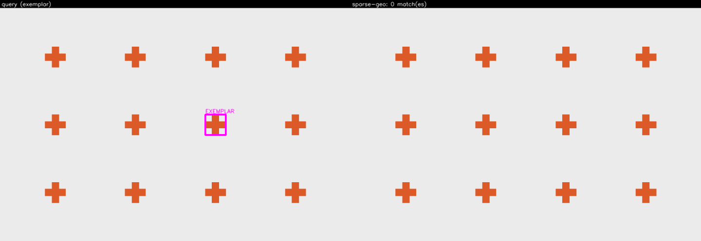
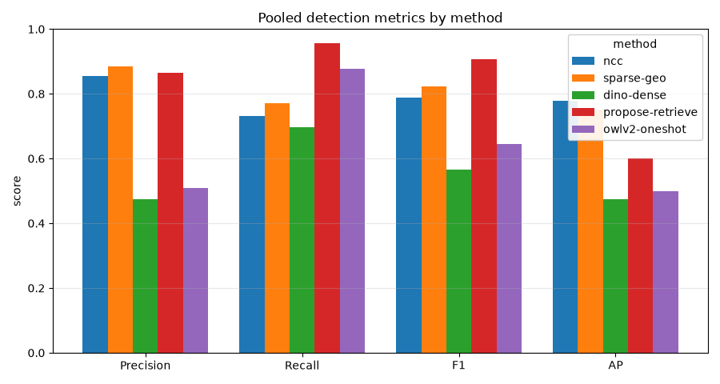
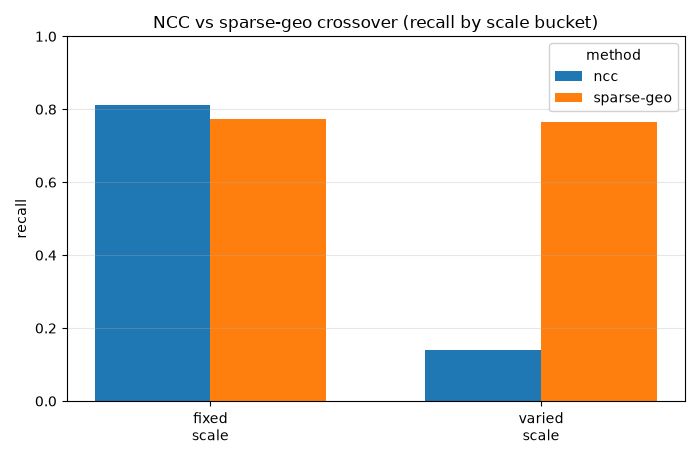
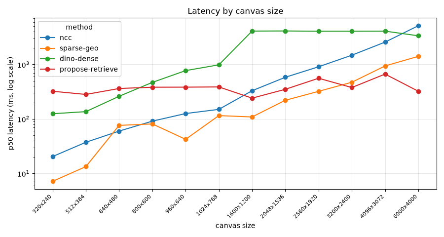

# Object Search Exploration

Draw a box around one object in an image; find every other instance of that same object
**in that same image**. Four independent search methods sit behind one interface, selectable
*before* the box is drawn, so the same query can be run through different algorithms and
compared side by side. A rating layer records how well each method did on each query, and a
statistics layer turns those ratings — plus objective metrics on ground-truthed images —
into a per-method scoreboard.

This is an **exploration harness, not a product**. Its value is that each method is
readable, editable, and measurable by an ML practitioner, and that adding a fifth method or
a whole new exploration is a small, obvious diff.

> **Status: Milestone 1 complete.** All four search methods, the canvas UI, the FastAPI
> backend, the SQLite rating/stats layer, and the evaluation harness are implemented and
> tested. The benchmark below is real, run over the committed demo set. Where a method is
> weak, the numbers say so — see [`docs/LIMITATIONS.md`](docs/LIMITATIONS.md).

## Quickstart

Pixi is the only supported environment manager. Do not use `pip`, `venv`, `uv`, or `conda`
directly — a single reproducible lockfile is the whole point.

```bash
pixi install            # solve + install from the committed pixi.lock
pixi run fetch-models   # download ONNX weights into models/ (needed for dino-dense + propose-retrieve)
pixi run serve          # FastAPI + static canvas UI on http://localhost:8000
```

Open the UI, pick a method, draw a box around one instance, and the matches for that method
are drawn back on the image with a diagnostics overlay. `ncc` and classical `sparse-geo` need
no weights; `dino-dense` and `propose-retrieve` need `fetch-models` first.

## The four methods

| Method | Key | Idea | Needs weights |
| --- | --- | --- | --- |
| 1 | [`ncc`](docs/methods/ncc.md) | Zero-model baseline: `cv2.matchTemplate` with `TM_CCOEFF_NORMED` over the full scene, then peak extraction and NMS. Pyramid scale search, optional rotation bank. | No |
| 2 | [`sparse-geo`](docs/methods/sparse-geo.md) | Keypoints on the crop matched into the scene, then **many** geometric models recovered rather than one (Hough voting / sequential RANSAC). Classical (SIFT/AKAZE/ORB) and learned (SuperPoint ONNX) backends. | No (classical) / yes (SuperPoint) |
| 3 | [`dino-dense`](docs/methods/dino-dense.md) | Dense deep-feature similarity: DINOv2 patch tokens for scene and exemplar, cosine-similarity map, calibrate, peak-pick. | Yes (DINOv2) |
| 5 | [`propose-retrieve`](docs/methods/propose-retrieve.md) | Propose → embed → retrieve: FastSAM class-agnostic proposals, DINOv2 region embeddings, nearest-neighbour rank against the exemplar. Its `propose()` and `embed_regions()` stages are independently callable — the Milestone 2 seam. | Yes (FastSAM + DINOv2) |

Method numbering follows the project brief, which is why there is no Method 4 (see
[`docs/ROBUSTNESS-BACKLOG.md`](docs/ROBUSTNESS-BACKLOG.md) for the deferred Methods 4 and 6).

## Sample runs — all four methods, side by side

Pre-rendered sample runs are committed under `docs/samples/` so the behaviour of each method
is reviewable without running anything. The gallery is produced by a single renderer that
**iterates the method registry**, so every registered method appears with no per-method code.
Regenerate the whole gallery with `pixi run samples` (deterministic — it regenerates
byte-for-byte).

The plain lattice scene (twelve identical instances) run through each method:

| [`ncc`](docs/samples/ncc/) | [`sparse-geo`](docs/samples/sparse-geo/) |
| --- | --- |
|  |  |
| [`dino-dense`](docs/samples/dino-dense/) | [`propose-retrieve`](docs/samples/propose-retrieve/) |
|  |  |

Each method's gallery also covers `cluttered-distractors`, `scatter-scaled`, and the
solid-rectangle `lattice-touching` scene, where texture-free methods honestly abstain rather
than guess. See each method's `docs/samples/<method>/index.md` for the per-scene outcome table.

## Benchmark

The full numbers, tables, and the four committed charts are in
[`docs/benchmark/results.md`](docs/benchmark/results.md). Run `pixi run bench` (full sweep,
needs fetched models) or `pixi run bench-ci` (model-free chipset subset), then
`pixi run bench-charts` to regenerate the figures. The charts render headlessly and are
byte-identical on re-render (EVAL-06).

**Pooled metrics over the 12-image demo set** (chipset repeats + scale/clutter synthetics,
IoU 0.5):

| method | precision | recall | F1 | mean AP | p50 latency |
| --- | --- | --- | --- | --- | --- |
| `ncc` | 0.913 | 0.922 | 0.918 | 0.484 | 238 ms |
| `sparse-geo` | 0.833 | 0.097 | 0.174 | 0.083 | 76 ms |
| `dino-dense` | 0.276 | 0.078 | 0.121 | 0.190 | 2259 ms |
| `propose-retrieve` | 0.748 | 0.951 | 0.838 | 0.635 | 291 ms |



**What the numbers actually say** (stated plainly, because a flattering benchmark would defeat
the entire point of the project):

- **`propose-retrieve` is the strongest general retriever** — best AP (0.635) and best recall
  (0.951) — at a moderate, roughly canvas-independent latency.
- **`ncc` wins the fixed-scale, near-identical regime decisively** (fixed-scale recall 0.989)
  but collapses when instance scale varies (varied-scale recall 0.30), and its cost grows
  steeply with canvas size (5.7 s at 6000×4000).
- **`sparse-geo` abstains on 11 of 12 images**: the chips are near-identical and low-texture,
  so the exemplar crop yields fewer than the 20 SIFT keypoints it requires, and it correctly
  declines rather than guess. This is the **NCC-vs-sparse-geo crossover** the literature
  predicts, made visible rather than averaged away.
- **`dino-dense` underperforms on this set** (F1 0.121) and is the slowest: the stride-14 token
  grid is too coarse to localise the small chips, and it is doing full-backbone inference.





The human-rating scoreboard (thumbs-up rate with Wilson intervals, Bradley-Terry ranking) is
wired end to end but starts empty — rating is a manual activity — so the thumbs chart renders
an honest "n = 0" panel until runs are rated in the UI.

## Limitations

Read [`docs/LIMITATIONS.md`](docs/LIMITATIONS.md) before drawing conclusions or sharing the
repo. In short: branch protection is not enforceable on a free private repo (INFRA-07 partial);
MobileSAM did not ship as a second proposal backend; the exported FastSAM `.onnx` is **AGPL-3.0**
and the SuperPoint weights are **non-commercial research-only**, both of which constrain how
this repo may be published or exposed; and `dino-dense` underperforms on the current demo set.

## Project layout

```
src/object_search/
├── schemas/          # ExemplarBox, Match, SearchResult, RunRecord, Rating (Pydantic, frozen)
├── inference/        # BaseInferencer, ONNXInferencer, DINOv2 / SuperPoint / FastSAM inferencers
├── search/
│   ├── registry.py   # @register_method -- the only indirection in the codebase
│   ├── ncc.py                # Method 1 -- self-contained
│   ├── sparse_geo.py         # Method 2 -- self-contained
│   ├── dino_dense.py         # Method 3 -- self-contained
│   ├── propose_retrieve.py   # Method 5 -- self-contained
│   └── common/       # calibration, peaks, nms, viz -- optional offerings, never mandated
├── api/              # FastAPI app, routes, dependencies
├── store/            # SQLite runs + ratings, Wilson intervals, stats queries
├── eval/             # ground-truth labels, metrics, benchmark, charts, Bradley-Terry, paired
├── log.py            # Loguru sink configuration -- the only place sinks are configured
└── cli.py            # sample rendering, model export, synthetic + chipset generation
frontend/             # static HTML/JS canvas UI served by FastAPI
assets/demo/          # demo images + ground-truth labels (committed)
docs/samples/         # pre-rendered sample runs (committed)
docs/benchmark/       # committed charts + results.md (results.json is gitignored)
models/               # ONNX weights (gitignored; fetched by `pixi run fetch-models`)
```

## Development

```bash
pixi run lint          # ruff check (line-length 100)
pixi run format        # ruff format
pixi run format-check  # ruff format --check (what CI runs)
pixi run typecheck     # mypy --strict
pixi run test          # pytest with a >=80% coverage floor
pixi run quality       # all four, in order

pixi run serve         # run the app on :8000
pixi run samples       # regenerate the committed sample gallery (all registered methods)
pixi run bench         # full benchmark sweep (needs fetched models)
pixi run bench-ci      # model-free chipset subset (ncc + classical sparse-geo)
pixi run bench-charts  # regenerate the committed charts + results.md
```

The quality gates are **hard gates, not advisory**. All four run in CI on every pull request.

Two conventions the tooling enforces mechanically, because they are easy to regress:

- **Loguru only.** `print()` is a lint error (ruff `T201`) and `import logging` is a lint
  error (ruff banned-api). Use `from loguru import logger`.
- **Coverage floor.** Dropping below 80% fails `pixi run test`, and therefore CI.

Install the local hooks once after cloning:

```bash
pixi run pre-commit install
```

## Conventions worth knowing before editing

- **Method modules are self-contained and top-to-bottom readable.** This deliberately
  overrides DRY. A method may inline its own variant of a shared helper if that reads better
  standalone; do not refactor a method purely to remove duplication.
- **ONNX Runtime for every learned model.** There is no PyTorch inference path, not even as
  a fallback. Every inferencer validates dtype and shape at construction, so a wrong model
  fails at load rather than at first frame.
- **Reproducibility.** Same image + box + method + config ⇒ identical results. Every
  stochastic step takes an explicit seed from config, but only where a seed genuinely controls
  something (see [`docs/methods/sparse-geo.md`](docs/methods/sparse-geo.md) on why RANSAC gets
  no config seed).
- **Frozen Pydantic v2 models** for every inter-layer contract; each method's `config_model`
  doubles as the JSON Schema that drives the UI form.

## License

The project source is MIT. **Model weights are not**, and are gitignored: the exported FastSAM
`.onnx` is AGPL-3.0 and the SuperPoint weights are non-commercial research-only. See
[`docs/LIMITATIONS.md`](docs/LIMITATIONS.md) before publishing the repo or exposing the API.
