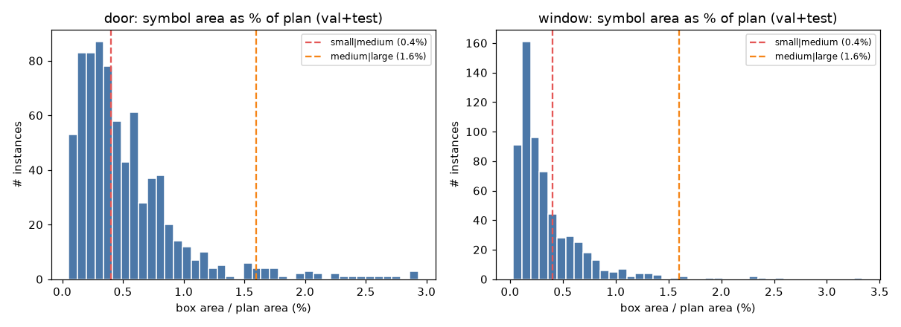
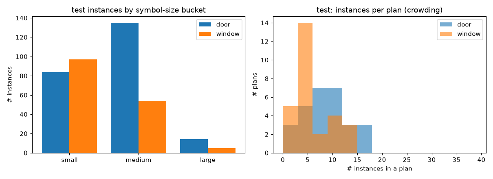

# Floor-plan findings — which method wins on the target domain (DOC-08)

This records the outcome of a real evaluation of the four+two search methods on the **Roboflow
floor-plans-500** target-domain dataset (`floorplans-door` / `floorplans-window`; see
[research-datasets.md](research-datasets.md)). Only **measured metrics** are recorded here — no
dataset images and no raw per-image data (those stay gitignored, regenerable via the run below).

**How it was produced.** Six methods (`ncc`, `mosse`, `sparse-geo`, `dino-dense`,
`propose-retrieve`, `owlv2-oneshot`) were run one-per-GPU on vast.ai, each doing its own sweep +
per-method domain threshold tuning (`pixi run tune-floorplans`, broadened multi-knob grids). Protocol:
tune on **val** (56 plans), report on the frozen **test** split (28 plans). Headline metric: **F1 @
IoU 0.5** at **1 exemplar**, tuned per method per class. `dino-dense` ran with the opt-in fixed-size
letterbox (`fixed_input_side=1120`).

> **Caveat — small test set (28 plans).** Trust the large gaps, not the small ones. `dino-dense` and
> `propose-retrieve` still lose 1 of 14 test plans per class to GPU-OOM (coverage 13/14); the
> letterbox cut `dino-dense`'s failures from 28/28 to 1. Numbers are one run at one operating point;
> they are directional evidence, not a leaderboard to over-fit.

## Dataset statistics

Both classes are converted from the same 84 plans (56 val + 28 test) — every plan has ≥1 door and
≥1 window, so the image sets are identical and only the kept boxes differ. Size buckets are
box-area ÷ plan-area: **small <0.4%, medium <1.6%, large ≥1.6%** (the same cuts the per-slice eval
uses).

| class / split | plans | instances | small | medium | large | instances/plan (min/med/max) |
|---|---|---|---|---|---|---|
| door / val | 56 | 527 | 54% | 43% | 3% | 3 / 8 / 29 |
| door / test | 28 | 233 | 36% | 58% | 6% | 2 / 8 / 17 |
| window / val | 56 | 463 | 75% | 25% | 1% | 1 / 6 / 40 |
| window / test | 28 | 156 | 62% | 35% | 3% | 1 / 4 / 14 |

Two facts shape the results: **almost every symbol is small/medium** (large is <6% everywhere), and
**windows skew smaller than doors** (62% small vs 36% on test). That is why small-symbol robustness —
where `dino-dense` fails outright and `ncc` holds up — is the decisive property on this domain.

## Result — winners differ by class

**Doors** (tuned F1 @ IoU 0.5, test):

| # | method | tuned F1 | default F1 | precision | recall | coverage |
|---|---|---|---|---|---|---|
| 1 | `propose-retrieve` | **0.459** | 0.459 | 0.55 | 0.39 | 13/14 |
| 2 | `ncc` | 0.248 | 0.164 | 0.57 | 0.16 | 28/28 |
| 3 | `sparse-geo` | 0.219 | 0.217 | 0.44 | 0.15 | 28/28 |
| 4 | `mosse` | 0.213 | 0.201 | 0.74 | 0.12 | 28/28 |
| 5 | `owlv2-oneshot` | 0.180 | 0.115 | 0.11 | 0.58 | 28/28 |
| 6 | `dino-dense` | 0.147 | 0.092 | 0.13 | 0.17 | 13/14 |

**Windows** (tuned F1 @ IoU 0.5, test):

| # | method | tuned F1 | default F1 | precision | recall | coverage |
|---|---|---|---|---|---|---|
| 1 | `ncc` | **0.403** | 0.226 | 0.43 | 0.38 | 28/28 |
| 2 | `sparse-geo` | 0.309 | 0.290 | 0.63 | 0.21 | 28/28 |
| 3 | `mosse` | 0.148 | 0.077 | 0.23 | 0.11 | 28/28 |
| 4 | `propose-retrieve` | 0.048 | 0.048 | 0.07 | 0.04 | 13/14 |
| 5 | `dino-dense` | 0.047 | 0.048 | 0.03 | 0.11 | 13/14 |
| 6 | `owlv2-oneshot` | 0.023 | 0.022 | 0.01 | 0.24 | 28/28 |

**`propose-retrieve` wins doors; `ncc` wins windows** — and `propose-retrieve` *collapses* on windows
(0.048), so the best method is class-dependent. **`ncc` is the most reliable all-rounder**: 2nd on
doors, 1st on windows, full 28/28 coverage, and (below) uniformly robust to symbol size.

## What the tuning + fixes bought

- **Domain tuning matters most for `ncc`/`mosse`:** `ncc` window F1 nearly doubled vs default
  (0.226 → 0.403); door 0.164 → 0.248. `owlv2` door 0.115 → 0.180.
- **`ncc`'s selected scale set is a single scale `[1.0]`.** Floor-plan symbols are drawn at a fixed
  size, so the default multi-scale search (0.75–1.3) manufactured false positives; tightening it is
  the single biggest domain-specific lever. `mosse` reached **0.74 precision** on doors the same way.
- **`owlv2` over-detects** (recall high, precision ~0.01–0.11, counting error MAE 38–107); capping
  `max_box_area_frac=0.1` helped but did not fix it. Not usable here without heavier calibration.
  Fine-tuning was tried next and measured as a negative result — see
  [`owlv2` floor-plan fine-tune](../reports/owlv2-floorplans-finetune.md): both arms regress doors
  vs. the pretrained baseline, and neither closes the gap to `propose-retrieve`/`ncc`.
- **The `dino-dense` letterbox works:** coverage 0/28 → 13/14 (OOM failures 28 → 1). Still not
  competitive, but no longer broken.

## Where each method fails — recall by symbol size (doors, test, 1 exemplar)

| method | small | medium | large |
|---|---|---|---|
| `ncc` | 0.31 | 0.31 | 0.29 |
| `propose-retrieve` | 0.34 | 0.42 | 0.36 |
| `owlv2-oneshot` | 0.61 | 0.56 | 0.36 |
| `mosse` | 0.19 | 0.25 | 0.36 |
| `dino-dense` | **0.00** | 0.25 | 0.18 |
| `sparse-geo` | 0.14 | 0.13 | 0.14 |

- **`dino-dense` cannot find small symbols** (recall 0.00 on small doors, 0.09 on small windows): the
  fixed letterbox shrinks a small door below the DINOv2 patch grid.
- **`ncc` is size-robust** (≈0.30 across door sizes) — a strong reason it is the dependable default.
- **`sparse-geo` needs size:** on windows its recall climbs from 0.13 (small) to 0.40 (large) —
  keypoint matching needs enough texture, which small stamped symbols lack.
- **`owlv2` biases toward small** (it over-detects everywhere), which is why its recall is inverted
  vs the others.

## Qualitative overlays (local, gitignored)

`pixi run python scripts/build_floorplans_report.py` builds a self-contained
`docs/benchmark/floorplans-report.html` with **TP/FP/FN overlays per method** on an easy and a hard
plan for each class — **green** = matched (TP), **yellow** = missed (FN), **red** = spurious (FP),
**orange** = the query exemplar. It is gitignored because the overlays embed the licensed floor-plan
images (the aggregate stat charts above carry no plan pixels and are committed). The overlays make it
visible at a glance: `dino-dense` leaves the small doors yellow (missed), while `ncc` and
`propose-retrieve` fill them green.

## Recommendation

- **Ship `ncc` as the dependable default** for floor-plan exemplar search — robust across both
  classes and all symbol sizes, full coverage, and it benefits most from the (cheap) domain tuning.
- **Prefer `propose-retrieve` specifically for doors** if a door-only workflow justifies loading the
  proposal + retrieval models.
- **Deprioritise `dino-dense` and `owlv2` here** — the former is blind to small symbols, the latter
  floods false positives.

## Reproducing

`pixi run fetch-datasets` (after dropping the Roboflow COCO export at
`datasets/_incoming/floorplans/`), then `scripts/gpu_bench.sh` on a CUDA box (it runs the per-method
sweep + `tune-floorplans`). Raw outputs land in the gitignored `docs/benchmark/` tree.
