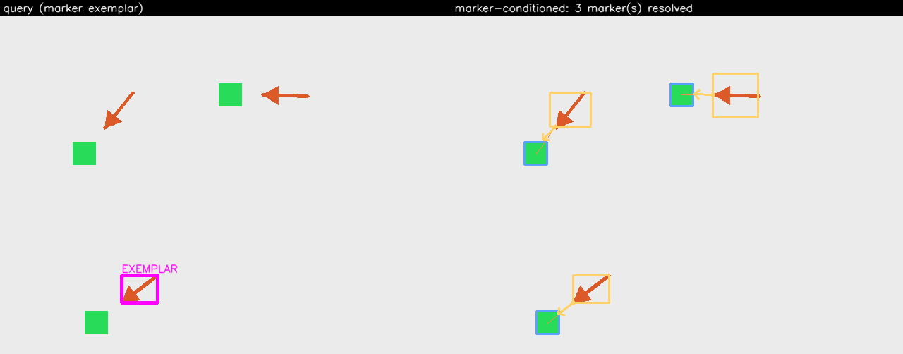
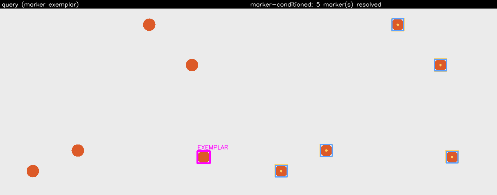
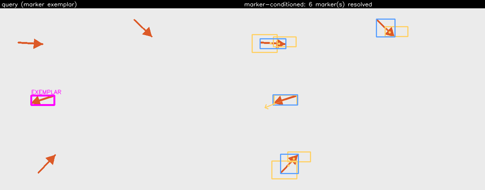

# Exploration 2 — `marker-conditioned` (marker → pointed-at object)

Milestone 2. Where the same-image search asks "find every other instance of *this object*", this
exploration asks "find every object *this marker gesture* is indicating". You draw a box around one
**marker** — an arrow, a caret, a dot — and the system finds every instance of that marker in the
image, recovers where each one points, and returns the best object-region proposal it points at.

An *exploration* is a registry-level concept mirroring a method (`explorations/registry.py`,
`@register_exploration`). This one composes four already-shipped seams and adds only the orientation
estimator and the scoring function; its result is an ordinary `SearchResult`, so it persists and is
scored through the Milestone 1 store/stats layer with **no schema migration**.

Implemented in [`src/object_search/explorations/marker_conditioned.py`](https://github.com/ortizeg/object-search-exploration/blob/main/src/object_search/explorations/marker_conditioned.py)
(the pipeline) and [`src/object_search/explorations/markers.py`](https://github.com/ortizeg/object-search-exploration/blob/main/src/object_search/explorations/markers.py)
(the orientation estimation). The numbered steps below match the numbered comments in the module.

## Pipeline

### 1. Find markers — reuse a Milestone 1 method wholesale

`markers = get_method(config.marker_method).search(image, marker_exemplar, marker_config).matches`.
The marker crop is just an exemplar box, so any registered method finds marker instances unchanged —
nothing new is registered to find markers. The result is capped at `max_markers`. If no markers are
found the exploration returns `outcome=EMPTY` with a diagnostic note — never a silent empty.

### 2. Estimate each marker's reference point and orientation

The one genuinely new piece of computer vision, in `markers.py`, by two paths that prefer the free
one (see **Pre-processing** for the mask, and **Post-processing** for the two orientation recoveries).
A symmetric marker (a dot) yields a centroid and **no direction** — never a guessed one.

### 3. Propose objects — once for the whole scene

`proposals = propose(image, config.proposal)`. The proposal stage dominates latency (EVAL-11), so it
is called **once** and the shared proposal set is scored against every marker — never once per marker.
If the proposal stage returns nothing the exploration returns `outcome=EMPTY` with a note.

### 4. Score every proposal per marker and keep the best

For each marker, every proposal is scored by the weighted sum below and the single best is kept as a
`Match` (one best proposal *per marker*; two markers may legitimately point at the same object, so no
NMS is applied across markers). Ties break on `(-score, box.y, box.x)`, so the pick is deterministic.

## Pseudocode

The steps below mirror the numbered comments in
`src/object_search/explorations/marker_conditioned.py`; read that module for the ground truth.
This is an *exploration* (Milestone 2), not one of the four search methods — it composes them.

```
1. markers <- get_method(marker_method).search(image, marker_exemplar, marker_config).matches
   cap at max_markers; if none found -> return EMPTY with a note   # reuse a Milestone 1 method wholesale

2. for each marker: estimate (reference_point, direction) via markers.py
       path A: fitted 2x3 affine present (sparse-geo) -> theta = atan2(c, a); disambiguate the
               180 deg flip by mapping the exemplar tip through the transform; confidence 1.0
       path B: no transform (ncc, dino-dense) -> PCA on the Otsu foreground mask; tip via the
               arrowhead-mass heuristic; confidence = normalised mass asymmetry
       symmetric / low asymmetry (dot) -> centroid, direction=None   # never a guessed direction

3. proposals <- propose(image, proposal)   # ONCE for the whole scene (proposal stage dominates latency)
   if none -> return EMPTY with a note

4. for each marker: score every proposal by the weighted sum (distance, direction, objectness, size),
       keep the single best as a Match  # one best proposal per marker; no cross-marker NMS
       ties break on (-score, box.y, box.x) for determinism
```

## Pre-processing (exact)

- **Marker crop for orientation:** `image[box.y:box.y2, box.x:box.x2]` in BGR. No colour conversion
  or resize happens in this module beyond cropping; the marker method does its own pre-processing and
  `propose` letterboxes/normalises the scene per the FastSAM inferencer's documented contract.
- **Foreground mask (PCA path):** the Otsu threshold of each pixel's Euclidean colour distance from
  the background, where the background colour is the **median of the crop's one-pixel border ring**
  (not the four corners — an arrow's tip and tail routinely land on box corners, so a corner sample
  would be marker-coloured and poison the estimate; a single tip pixel is negligible against a whole
  ring). Distance-from-background rather than a fixed grey threshold makes it robust to fill ratio: a
  thin arrow occupies a minority of its box while a dot occupies a majority.

## Post-processing (exact)

### Orientation, path A — the transform (preferred, free)

When the marker method fitted a per-instance 2×3 affine (`sparse-geo` fills `Match.transform`, a
flattened row-major `[a, b, tx, c, d, ty]`), the rotation falls out directly as `theta = atan2(c, a)`
(scale cancels). The 180° flip a bare rotation cannot resolve is settled by mapping the **exemplar
marker's own tip** through the same transform: the pointing direction runs from the instance centroid
toward that mapped tip, which is also taken as the reference point. Confidence is `1.0`.

### Orientation, path B — PCA on the mask (fallback)

When no transform is available (`ncc`, `dino-dense` supply none), the principal axis of the foreground
mask is recovered by PCA. The axis is a line, not a ray, so the tip is disambiguated by an
**arrowhead-mass heuristic**: an arrow is head-heavy (a filled triangle plus shaft), so the side of the
centroid carrying more foreground mass is the head; the tip is the farthest foreground pixel on that
side and the direction runs centroid → tip. Confidence is the normalised mass asymmetry.

### Symmetric / low-confidence → no direction

Below a mass-asymmetry tolerance (a dot, a plus, a blob), guessing a direction would be a fabricated
signal, so the estimator returns the **centroid and `direction=None`**. This is a real answer, not a
failure: it means "no direction to guess", and the scorer drops the direction term accordingly.

### The scoring formula

The best proposal per marker maximises a documented, config-exposed weighted sum — every term is a
real design surface, not a buried constant:

```
score = w_distance   · exp(-‖proposal_centre − reference‖ / length_scale)   # proximity
      + w_direction   · max(0, cos∠(direction, reference→proposal_centre))   # alignment (0 if none)
      + w_objectness  · proposal.objectness                                  # trust the proposal stage
      + w_size        · min(r, 1/r),  r = proposal_diag / expected_diag      # size prior
```

- **proximity** decays with distance from the reference point over the marker's length scale
  (`marker_diagonal × size_prior_frac`), so nearer proposals score higher.
- **direction** is the clamped cosine between the pointing vector and reference→proposal-centre; it
  contributes **zero** when `direction is None`, so a symmetric marker scores on distance, objectness
  and size only.
- **objectness** trusts the proposal stage's own score.
- **size** is `1.0` when the proposal diagonal matches the expected object size and decays either side
  in log-size (the `min(r, 1/r)` form is symmetric in over- and under-size).

## Config reference

Generated from `MarkerConditionedConfig`'s JSON Schema — the same schema that drives the UI form, so
it cannot drift from the code. Every `w_*` weight is `Field`-described and therefore appears in the
form directly.

| field | default | effect |
| --- | --- | --- |
| `marker_method` | `"sparse-geo"` | Milestone 1 method used to find marker instances. Rendered as a select of the registered methods. A rotation-invariant finder (classical `sparse-geo`) resolves rotated markers; `ncc` is model-free but not rotation-invariant. |
| `marker_config` | `{}` | Config for the marker-finding method; validated against that method's own schema. |
| `proposal` | `FastSAMConfig()` | Class-agnostic proposal-stage config (FastSAM). |
| `w_distance` | `1.0` | Weight on proximity to the reference point. |
| `w_direction` | `0.5` | Weight on alignment with the marker's pointing vector (inert for symmetric markers). |
| `w_objectness` | `0.5` | Weight on the proposal's own objectness. |
| `w_size` | `0.3` | Weight on how well the proposal matches the size prior. |
| `size_prior_frac` | `2.0` | Expected object size as a multiple of the marker's box diagonal; also sets the proximity length scale. |
| `max_markers` | `20` | Cap on how many marker instances to resolve. |

## Known failure modes

- **180° ambiguity on the PCA path.** A short, near-symmetric arrowhead gives a weak mass asymmetry;
  below the tolerance the estimator returns no direction (centroid only) rather than guessing a wrong
  one. The `dots` sample is the deliberate symmetric case — five markers resolved, no arrows drawn.
- **Markers the finding method misses.** Step 1 is only as good as the chosen method. `ncc` is not
  rotation-invariant, so on the randomly-rotated `arrows` demo it finds only the exemplar-orientation
  instance; a rotation-invariant finder (classical `sparse-geo`) is the fix, but it abstains on the
  low-texture synthetic arrows (< 20 keypoints) — a genuine data/method-fit limitation, documented in
  the backlog, not hidden.
- **Proposal over-segmentation.** FastSAM may return several fragments of one object; the scorer picks
  the best-scoring fragment per marker, which can be a part rather than the whole. A ray-to-box
  distance and per-marker size prior (backlog) would help.

## ROBUSTNESS BACKLOG

Deferred deliberately (mirrored from the module docstring and `docs/ROBUSTNESS-BACKLOG.md`); none is
built in this phase:

- **A learned marker / keypoint tip detector**, replacing the arrowhead-mass heuristic, so the tip is
  found directly rather than inferred from mass asymmetry.
- **Per-proposal appearance matching** via the already-shipped `embed_regions()`, so a proposal must
  also *look* like the pointed-at object, not merely sit in the right place.
- **Multi-marker disambiguation when arrows cross** — a global assignment (each proposal to at most
  one marker) rather than scoring every proposal against every marker independently.
- **A dedicated marker detector** trained on marker gestures, instead of reusing a Milestone 1 method
  whose invariances were designed for whole objects.

## Sample runs

Regenerated by `pixi run samples` and committed under
[`docs/samples/marker-conditioned/`](../samples/marker-conditioned/) (see its
[`index.md`](../samples/marker-conditioned/index.md) for the per-image outcome table). The marker
finder for the committed gallery is `ncc` (model-free); the proposal stage uses FastSAM on the CPU
provider, so the panels are reproducible.

| image | panel |
| --- | --- |
| `arrows-with-targets` — the marker's arrow, the chosen proposal on the target it points at, linked |  |
| `dots` — five symmetric markers resolved, no direction guessed |  |
| `arrows` — bare arrows; `ncc` finds the exemplar-orientation instance (rotation-variance limit) |  |
