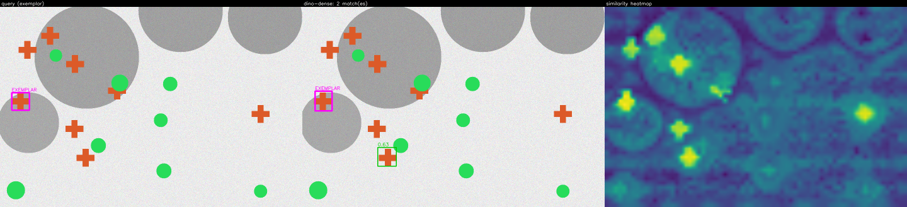
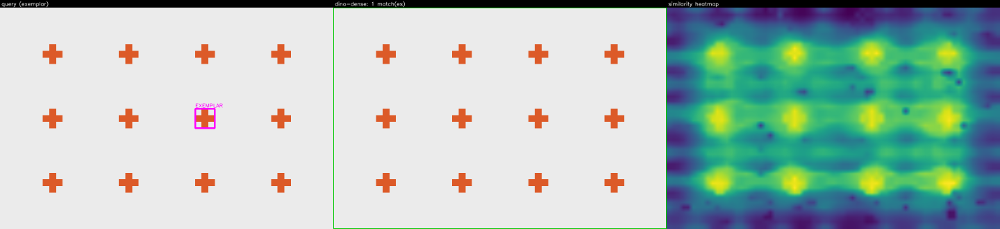
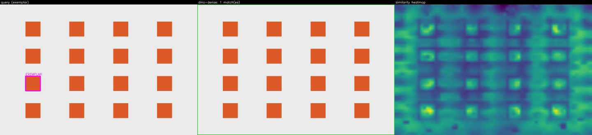
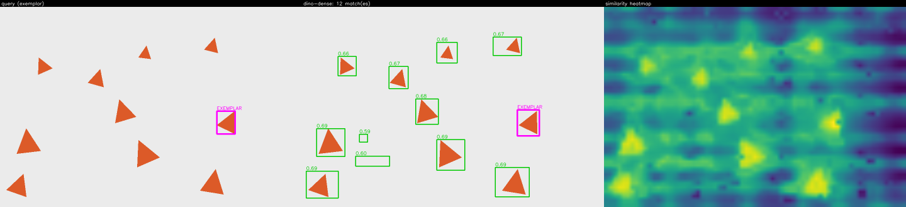

# Method 3 — `dino-dense` (DINOv2 dense-token best-part matching)

The general-purpose default for "same object, moderate appearance variation". It embeds the
exemplar crop and the whole scene into DINOv2 dense patch tokens and scores every scene location
by the **mean of its top-k cosine similarities to the crop's own tokens** (`max-token` scoring,
the default) — "how well does the single best-matching part of the exemplar explain this
location". It upsamples the similarity map to pixels, thresholds it at a calibrated cut, runs
connected components **at that threshold**, keeps components whose area is consistent with the
exemplar, and turns each into a box. Where `ncc` (Method 1) correlates raw intensities and so
misses instances under pose or lighting change, DINOv2 features are appearance-robust — this is
the method that finds "the same object, differently posed".

> **Why not a single mean-pooled prototype?** The original v1 mean-pooled the crop tokens into
> one vector and scored the cosine to it. On richly-textured objects that vector is a mushy
> average of diverse parts that matches *everything* weakly, so the similarity map is low-contrast
> and every instance fuses into one image-spanning blob (textured F1 ≈ 0.03). Replacing it with
> best-part `max-token` scoring, threshold-level component extraction, exemplar-relative area
> bounds, and the `contrast` calibrator below lifted textured F1 to ≈ 0.70. The `prototype` mode
> is retained as a readable baseline (`scoring="prototype"`).

The module `src/object_search/search/dino_dense.py` is meant to be read top to bottom; the
numbered steps below match the `# 1.` … `# 9.` comments in `search()` one-for-one (METHOD-11).
The backbone is the shared `DINOv2Inferencer` built in Phase 6 (1/2) and reused here — one
download, one preprocessing contract, reused again by Method 5 in Phase 7.

## What it is and when it wins

`dino-dense` wins exactly where `ncc` loses: instances that are the same object but differ in
**pose, rotation, or lighting**. DINOv2's self-supervised features are largely invariant to
those, so a rotated or relit copy still scores high against the prototype. It costs one ONNX
forward pass over the scene (tens to a few hundred ms on CPU) and is coarser than NCC — boxes
are quantised to ~14 px patches — so for near-identical, pixel-aligned repeats at the exemplar's
scale, NCC is still the cheaper, sharper tool. That crossover is the whole reason both exist.

## Algorithm

### 1. Get the one shared DINOv2 inferencer

The inferencer is built once, lazily, from the gitignored weight and cached at module level, so
every query reuses the **same** loaded model. When the weight is absent the method returns
`outcome=error` with a `model_unavailable` note rather than raising, so the sample renderer and
the API degrade honestly. (The `SearchFn` contract shares nothing but `(image, exemplar,
config)`, so the method loads its own cached backbone rather than reading `app.state` — see the
deviation note in the phase summary.)

### 2. Embed the crop → **L2-normalize** the token bank (or the prototype)

The exemplar crop is embedded on its own. Under the default `max-token` scoring its patch tokens
are kept as a **bank** — one L2-normalized vector per part — so a scene location can match some
*actual* part of the exemplar rather than the washed-out average of all its parts. Under
`prototype` scoring the tokens are mean-pooled into one vector, then L2-normalized once (pool
first, normalize second, so the prototype's self-cosine is `1.0`). Both are computed each call;
`config.scoring` selects which one step 4 uses.

### 3. Run the scene at high resolution (capped) → **L2-normalize** the grid

DINOv2's stride-14 patches are coarse, so a higher input resolution buys a finer similarity map.
The scene is run at native resolution up to a cap (`scene_max_side`, default 1568); a scene whose
long side exceeds the cap is **downscaled and the cap is logged** — never silently truncated,
which is how a 6000 px image would otherwise become a handful of meaningless tokens. The
inferencer snaps each side to a multiple of 14 and returns the scale factors that invert the
snap. Every returned token is then L2-normalized.

### 4. Similarity map — best-part (`max-token`) or prototype

Under `max-token` (default), each scene token's score is the **mean of its top-`match_tokens`
cosines to the crop token bank**: compute the `(N_scene, M)` matrix of cosines, take each row's
`k` largest, average them. This best-matching-part score is high on true instances and low on
background — a far sharper contrast than the `prototype` dot `normalized_prototype ·
normalized_grid`, whose mean-of-parts vector only half-matches each true part. Either way the
result is a `(gh, gw)` map in `[-1, 1]`. Both sides are L2-normalized **before** any dot product,
so these are genuine cosines rather than an unnormalized dot dominated by token **magnitude** —
and DINOv2-small ships high-norm background "artifact" tokens whose magnitude would otherwise
dominate a raw dot. Normalize, then dot, in that order.

### 5. Bilinearly upsample the **map** (not the tokens)

The `(gh, gw)` map is bilinearly upsampled to the model-input pixel resolution using the scale
factors the inferencer returned. The token grid covers a snapped input of `gh·14 × gw·14` px, so
the true input size is `gw·14 / scale_x` by `gh·14 / scale_y`; `cv2.resize` maps source cell
centre `(gx+0.5)` to destination fraction `(gx+0.5)/gw`, which is exactly each patch centre, so a
token peak lands on its pixel. Upsampling the **map** is cheap; upsampling the 384-d tokens first
would be 384× the work for the same result. A test pins that a known token peak upsamples to the
right pixel.

### 6. Calibrate the threshold — the `contrast` strategy (default)

Absolute cosine thresholds **do not transfer across images** for deep features, so the cut is
calibrated per image from the token-resolution similarity distribution. The default `contrast`
strategy (computed locally in `dino_dense.py`) blends two anchors:

- a **background anchor** `mean + std` — where the background bulk ends, and
- a **foreground anchor** `0.85 × p99.5` — a fraction of the near-peak, relative to the strongest
  matches rather than an absolute cosine —

at a 50/50 weight. On the high-contrast `max-token` map this tracks the per-image optimum
(pooled textured F1 ≈ 0.70 on a broad plateau). The old default `gmm` fits two Gaussians and cuts
at the posterior boundary, but on this heavy-tailed map the tiny foreground weight drags that
boundary down into the **background shoulder**, under-thresholding so badly that every instance
fused into one image-spanning box — that regression is why `contrast` replaced it. The classical
strategies remain available and delegate to `common.calibration`: `gmm`, `self-similarity`
(anchors on `self_score = 1.0`), `ratio` (largest gap in the top scores), and `fixed` (passes
`config.threshold`). Every path returns an inspectable **reason** in the diagnostics notes. The
`contrast` coefficients are tuned to the score *distribution*, **never fit to the ground-truth
boxes**.

### 7. MATCH components at the accept threshold, bounded to the exemplar's size

The upsampled map is thresholded **at the accept threshold itself** and
`cv2.connectedComponentsWithStats` labels the blobs. Growing components at the threshold — not at
a sub-threshold floor — is load-bearing: the box of a match is the extent of the above-threshold
region only, so a low-contrast shoulder just below the threshold can no longer bridge distinct
instances into one image-spanning blob (the bug the old code shipped). **Label 0 (background) is
skipped explicitly** — emitting it would be one image-sized false positive. Each remaining
component is bounded to the exemplar: below `min_area_frac × exemplar_area` it is a fragment,
above `max_area_frac × exemplar_area` a merged/background blob — both dropped. The bounds scale
with the exemplar, so they hold across the 300× canvas range without per-image tuning. Surviving
boxes are scaled back from the capped inference resolution to original scene pixels; each score is
the peak similarity inside its component.

### 8. Emit every match; log sub-threshold candidates separately

Every component clearing the threshold in step 7 becomes a `Match`. **METHOD-12: every clearing
component survives — there is no single-best / argmax-only short-circuit; connected components
returns as many instances as the image contains.** The component overlapping the exemplar box is
labelled `is_exemplar=True` rather than dropped or double-counted (METHOD-04c). Separately, a
second connected-components pass at a floor `candidate_margin` **below** the threshold yields the
top `max_candidates` `Candidate`s **with raw scores** — the candidate LOG only, never emitted as
matches, so their coarser (possibly merged) boxes cannot pollute the returned detections while
still letting an offline sweep rebuild a PR curve (EVAL-08).

### 9. Assemble diagnostics and the result

`Diagnostics` carries the upsampled similarity map as a base64 PNG heatmap (the UI's debug
overlay) plus `metrics` (chosen threshold, grid size, `cap_engaged`/`cap_scale`, component and
match counts, similarity max/mean). `LatencyBreakdown` attributes the ONNX forward pass to
`inference_ms` and the rest to `postprocess_ms` (EVAL-11). A run that clears nothing returns
`outcome=EMPTY` with a note, never a silent empty (METHOD-04c).

## Pre-processing (exact)

The ONNX numbers live in the `DINOv2Inferencer` docstring and the Phase 6 (1/2) doc and are not
re-derived here; they are, verbatim: input `pixel_values`, f32, NCHW, RGB; scale `1/255`, mean
`[0.485, 0.456, 0.406]`, std `[0.229, 0.224, 0.225]`; **bicubic** resize with **snap-to-14** and
**NO centre-crop**. Three points matter specifically for this method:

- **Snap-to-14 is mandatory, and the scale factors travel with the tokens.** DINOv2 does not
  validate the multiple-of-14 requirement; the stride-14 patch conv silently floor-divides, so an
  un-snapped side drops its trailing pixels and produces a *systematic spatial offset* in the
  similarity map. Snapping removes it, and the returned `scale_x`/`scale_y` are what let step 5
  map token coordinates back to real pixels.
- **No centre-crop.** HF's default preprocessor shortest-edge-resizes then centre-crops to
  224×224, silently discarding the image border. This method needs the **whole** scene, so the
  inferencer disables the crop.
- **Register tokens are stripped by a *derived* count, not a hardcoded `1`.** The correct slice
  is `[1 + n_register:]` (one CLS plus any register tokens). For this model,
  `onnx-community/dinov2-small-ONNX`, **`n_register = 0`** — it ships no register tokens, so the
  slice is effectively `[1:]`. The count is nonetheless *derived from the token count at load*
  (`n_register = tokens − 1 − gh·gw`) rather than hardcoded, because HF itself shipped a bug here
  and a with-registers variant would report `n_register = 4` and silently shift the whole feature
  map by four patches if the slice were pinned to `1`. Deriving it turns that silent shift into a
  load-time check.

**Positional-embedding interpolation is fixed at export time.** FB's reference implementation
interpolates the position embeddings with `offset=0.1` and antialiasing; HF uses
`align_corners=False`; the two **differ**. Whichever the exporter used is baked into the `.onnx`
graph. This method uses the pinned `onnx-community` fp32 export and does **not** attempt to
re-derive or "correct" the interpolation — the export in use is recorded and treated as fixed.

## Post-processing (exact)

- **L2-normalize every token before any dot product** (cosine, not a magnitude-dominated dot) —
  step 4.
- **`max-token` best-part scoring** (mean of top-k cosines to the crop bank) for a high-contrast
  map; `prototype` mean-pool is the low-contrast baseline — step 4.
- **Upsample the MAP, not the tokens**, using the inferencer's scale factors so token centres
  land on their pixels — step 5.
- **Calibrate the threshold with `contrast`** (blend of a background and a foreground anchor);
  absolute cosine thresholds do not transfer across images — step 6.
- **Grow MATCH components at the accept threshold**, skip `label 0` (background), and bound area to
  `[min_area_frac, max_area_frac] × exemplar_area` so fragments and merged blobs drop out — step 7.
- **Emit every clearing component** (METHOD-12); log sub-threshold candidates separately for an
  offline PR sweep (EVAL-08) — step 8.

## Config reference

Generated from `DinoDenseConfig`'s JSON Schema — the same schema that drives the UI form — so it
cannot drift from the code.

| field | default | effect |
| --- | --- | --- |
| `scene_max_side` | `1568` | Cap on the scene's longest side (pixels) before DINOv2 inference. Higher = a finer similarity map but more tokens and memory; a scene above this is downscaled and the cap is logged. 1568 = 112 patches. |
| `scoring` | `"max-token"` | How a scene token is scored. `max-token` = mean of its top-`match_tokens` cosines to the crop token bank (best-matching-part, high contrast). `prototype` = dot against one mean-pooled vector (low-contrast baseline). |
| `match_tokens` | `3` | For `max-token`: how many of the closest crop tokens are averaged per scene token. 1 = pure nearest-token max; a few smooths single-token flukes. |
| `calibration` | `"contrast"` | How the accept threshold is chosen when `threshold` is `null`. `contrast` blends a background anchor (mean+std) with a foreground anchor (a fraction of the high percentile), tuned for the `max-token` map. `gmm`/`self-similarity`/`ratio` delegate to `common.calibration`. |
| `threshold` | `null` | Fixed accept threshold on the raw cosine similarity. `null` ⇒ use the calibrator. |
| `candidate_margin` | `0.1` | How far below the accept threshold a component is still logged as a sub-threshold candidate for offline PR sweeps (EVAL-08). |
| `min_component_area` | `4` | Absolute floor on connected-component area in pixels. The effective floor is the larger of this and `min_area_frac × exemplar area`. |
| `min_area_frac` | `0.12` | Size-relative floor: a component smaller than this fraction of the exemplar's area is a fragment and is dropped. |
| `max_area_frac` | `8.0` | Size-relative ceiling: a component larger than this multiple of the exemplar's area is a merged/background blob and is dropped (a 1.6× scaled instance with a rotated bounding box tops out near 5×). |
| `max_candidates` | `50` | How many top components (with raw scores) to keep for the EVAL-08 candidate log. |
| `seed` | `0` | `random_state` for the gmm calibrator (its only genuinely stochastic step). |
| `retain_frac` | `0.7` | self-similarity accepts scores above `self_score × retain_frac` (`self_score = 1.0`). |

## Known failure modes

- **Stride-14 coarseness.** Even with high-res inference and upsampling, boxes are quantised to
  ~14 px patches; a small object a few pixels across is a single fuzzy token. This is the headline
  limitation and the reason for the sliding-window / FeatUp backlog items.
- **Very large scenes hit the resolution cap.** Above `scene_max_side` the scene is downscaled
  (and it is logged), so effective localisation on a 6000 px image is coarser than the cap
  suggests.
- **Small objects below the token grid.** On the fixed-scale chipset (chips ~36–46 px) a whole
  instance spans ~2–3 stride-14 tokens, so its box is imprecise or merges with a neighbour and
  often misses the IoU-0.5 bar — which is why NCC, not this method, owns the flat-chip regime.
  `max-token` scoring sharpens contrast but does not change the grid pitch.
- **Weights absent.** With no weight present the method returns `outcome=error` with a
  `model_unavailable` note rather than raising.

## ROBUSTNESS BACKLOG

Deferred deliberately (mirrored verbatim from the module docstring and
`docs/ROBUSTNESS-BACKLOG.md`); none is built in this phase:

- **Sliding-window backbone inference** for very large scenes, so localisation no longer degrades
  at the resolution cap.
- **Learned feature upsampling (FeatUp)** to recover sub-patch localisation from the stride-14
  grid without a full high-res forward pass.
- **SAM-based box refinement** — snap each coarse component box to the nearest segment mask.
- **Spatially-structured (not order-free) part matching.** `max-token` scoring already does
  many-to-many token similarity (**DONE** — it replaced the mean-pooled prototype and lifted
  textured F1 from ≈ 0.03 to ≈ 0.70), but it pools the top-k cosines with no geometric constraint
  on *where* the matching parts sit. A spatial-consistency term (parts arranged like the exemplar)
  would cut clutter false positives further.
- **DINOv3 backbone swap** once a clean ONNX export exists.

## Sample runs

Regenerated by `pixi run samples` and committed under
[`docs/samples/dino-dense/`](../samples/dino-dense/) (see its
[`index.md`](../samples/dino-dense/index.md) for the per-image outcome table). Each panel shows
the query, the matches overlay, and the DINOv2 similarity heatmap.

| image | panel |
| --- | --- |
| `cluttered-distractors` — appearance-robust matches amid clutter |  |
| `lattice-plain` — repeated instances on a plain lattice |  |
| `lattice-touching` — touching instances (heatmap shows the coarseness) |  |
| `scatter-scaled` — scale + pose variation, where `dino-dense` beats `ncc` |  |

## Pseudocode

**Method ③ dino-dense** — third of the four *implemented* methods (implementation numbering
①–④: `ncc`, `sparse-geo`, `dino-dense`, `propose-retrieve`; source-research numbering 1, 2, 3, 5,
with research Methods 4 and 6 deferred). The steps below mirror the `# 1.` … `# 9.` comments in
`search()` (METHOD-11); read `src/object_search/search/dino_dense.py` for the ground truth.

```
1. inferencer <- the ONE shared, module-cached DINOv2Inferencer
   if weight absent: return ERROR with a model_unavailable note  # never raise

2. embed the exemplar crop -> L2-normalize its patch tokens -> token BANK (one vector per part)
   (prototype mode: mean-pool the tokens first, then normalize -> self-cosine 1.0)

3. run the SCENE at native resolution capped at scene_max_side  # downscale + LOG the cap if above
   snap each side to a multiple of 14; strip CLS + n_register tokens (n_register DERIVED, not hardcoded)
   L2-normalize every returned token -> grid

4. max-token (default): each scene token = mean of its top-match_tokens cosines to the bank
   (prototype mode: sim = prototype . grid) -> a (gh, gw) cosine map in [-1, 1]  # normalize, THEN dot

5. bilinearly upsample the MAP (not the tokens) to pixel resolution using the inferencer scale factors
   (token centre (gx+0.5) maps to its pixel; upsampling tokens would be 384x the work)

6. calibrate the accept threshold (contrast default): blend background (mean+std) and foreground
   (0.85*p99.5) anchors on the map's own distribution  # absolute cosine thresholds do not transfer

7. threshold AT the accept cut -> connectedComponentsWithStats; SKIP label 0 (background) explicitly
   drop components outside [min_area_frac, max_area_frac] * exemplar_area (fragments / merged blobs)
   surviving boxes -> Matches (scaled back to original pixels; score = peak similarity inside)
   # METHOD-12: every clearing component survives; label the one overlapping the exemplar is_exemplar

8. SEPARATE pass at candidate_margin BELOW the threshold -> top max_candidates Candidates WITH raw
   scores (candidate LOG only, for the EVAL-08 sweep; never emitted as matches)

9. assemble Diagnostics (upsampled heatmap + metrics) and LatencyBreakdown
   a run that clears nothing returns EMPTY with a note (METHOD-04c)
```

## References

- Oquab et al., "DINOv2: Learning Robust Visual Features without Supervision", 2023: https://arxiv.org/abs/2304.07193
- DINOv2 code: https://github.com/facebookresearch/dinov2
- ONNX model used here (`dinov2-small-ONNX`): https://huggingface.co/onnx-community/dinov2-small-ONNX
