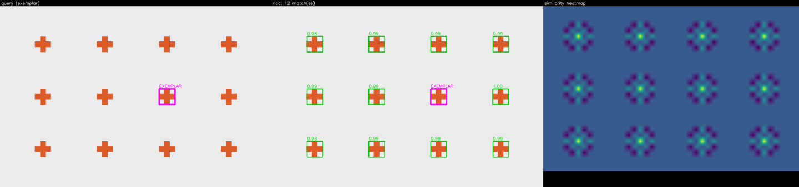
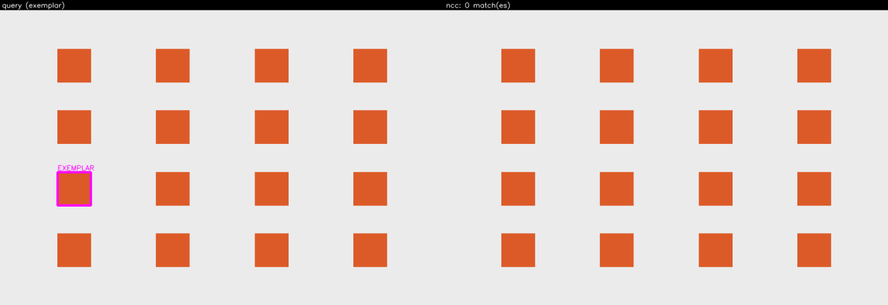
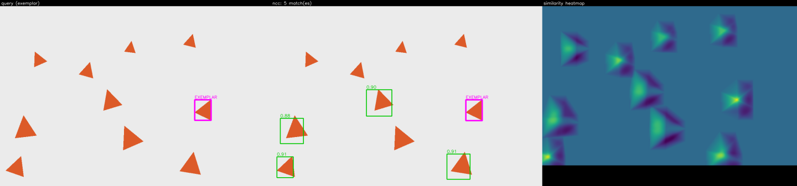
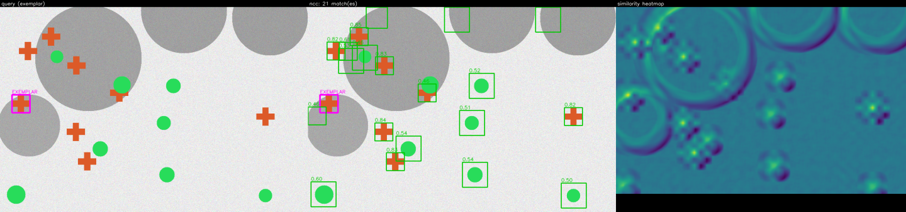

# Method 1 — `ncc` (normalized cross-correlation template matching)

The zero-model baseline. It correlates the exemplar crop against the whole scene with
`cv2.matchTemplate` / `TM_CCOEFF_NORMED`, over a scale pyramid, and turns the response peaks
into boxes. No weights, no training, milliseconds per query.

The module `src/object_search/search/ncc.py` is meant to be read top to bottom; the numbered
steps below match the `# 1.` … `# 9.` comments in `search()` one-for-one (METHOD-11).

## What it is and when it wins

NCC wins when the repeated instances are **near-identical and near the exemplar's scale**: a
tray of the same part, tiles, repeated UI glyphs. There it is genuinely hard to beat and
costs milliseconds with no model. The default **rotated-template bank** (`±35°`) plus the
**`repeat-aware`** accept rule (below) also let it recover a meaningful share of rotated and
rescaled repeats — VARIED F1 `0.24 → 0.46`, CLUTTERED `0.31 → 0.77` — **without** giving up its
fixed-scale strength (EASY/TEXTURED stay at F1 `1.00`). It still loses on the harder pose/scale
instances whose raw-intensity correlation falls too low, and on lighting change — that is where
`dino-dense` and `sparse-geo` win. See [`../reports/ncc-improvement.md`](../reports/ncc-improvement.md)
for the measured iteration log.

The cost of the bank is latency: the rotation × scale correlations are a large constant factor,
so on the 6000×4000 chipset a query runs in seconds rather than milliseconds. That trade is
reported honestly in the latency-by-canvas chart; FFT-based correlation (ROBUSTNESS BACKLOG) is
the mitigation if it ever needs to be interactive at that resolution.

## Algorithm

### 1. Crop the exemplar and guard against a textureless template

Compute the crop's standard deviation **first**. A flat crop makes `TM_CCOEFF_NORMED`
degenerate (`0/0`) and OpenCV returns a **constant map** — `1.0` at every pixel on 4.10,
`0.0` on the pinned 4.13 and on 5.x — never a NaN. Below `std < 1e-6` the method returns
`outcome=EMPTY` with a diagnostics note rather than emitting a wall of confident false
positives. This is mandatory, and the behaviour is pinned by a test so an OpenCV bump is
caught (see PITFALLS §1.1).

### 2. Build the scale pyramid

**Rescale the SCENE, then crop the template from the downscaled scene.** This reverses the
intuitive "resize the template" approach, and the reversal is measured: resizing the template
independently drops the exemplar's own self-match from `1.0000` to `0.3071`, and does so
**non-monotonically**, so it cannot be corrected by a per-level offset. Cropping from the
already-resized scene keeps the self-match at `1.0000` (PITFALLS §1.3). Levels whose scaled
template would be `< 8 px` on a side, or larger than the level image, are skipped.

### 3. Build the rotated-template bank

Default `angles_deg = (-35, -23.3, -11.7, 0, 11.7, 23.3, 35)` — a **7-step bank over ±35°**
(~11.7° spacing). Raw-intensity correlation loses a rotated instance within ~10–15°, so a bank
this dense is what lets NCC recover rotated repeats; **7 angles measured best** (9 over-samples —
extra false peaks, no recall gain; 5 leaves gaps). It is a large constant-factor cost
(levels × angles correlations); a caller who knows the scene is axis-aligned can set `(0.0,)`.
A rotated crop leaves fabricated constant corners (up to **half** the template at 45°) that
correlate with any uniform region. The fix is a **warped mask** passed to `matchTemplate`, eroded
by one pixel to kill the interpolated fringe — chosen over inscribing an axis-aligned rectangle
because that would throw away real template pixels near the corners (PITFALLS §1.6).

**`mirror` (default `False`) — a separate knob, not a wider bank.** With `mirror=True` every
variant above also yields a horizontally flipped sibling (`cv2.flip(…, 1)`), template and mask
flipped **together**, after the rotation. A reflection is not in the rotation group, so a mirrored
instance is unreachable by *any* bank width — the archetype is a floor-plan door drawn with the
opposite swing hand. Flipping the already-eroded mask is valid because a flip is a pure reflection
on the pixel lattice: it permutes pixels without resampling, so the mask still marks exactly the
real (non-fabricated) pixels and the §1.6 corner-honesty invariant carries over unchanged. It
doubles the correlation count (≈ doubles latency) *and* doubles how many candidate templates can
throw a false peak, so it is a per-domain choice rather than a default.

### 4. Correlate over the FULL scene at every level

`cv2.matchTemplate(scene_level, template_level, cv2.TM_CCOEFF_NORMED)`. **Never** crop the
search region: restricting the extent changes ~73% of the returned floats and shifts the peak
from `0.99999994` to `1.0`, the single biggest threat to "same input ⇒ identical results"
(PITFALLS §1.8). Any NaN in the response is replaced with `-inf` before peak finding so it can
never win an argmax.

### 5. Extract peaks per level (standardised first)

Peaks come from `common.peaks.extract_peaks` with the configured strategy and the template
size at that level. The spurious noise floor of `TM_CCOEFF_NORMED` varies ~15× with template
size (`0.577` at 8×8 vs `0.039` at 128×128), so a naive argmax across levels favours the
smallest template. Each level's map is therefore **z-scored against its own median/MAD** before
peaks are compared across levels; because that transform is monotone, peak locations are
unchanged but the returned z-score is comparable across levels. The raw score is carried
alongside for the threshold and the candidate log (PITFALLS §1.4).

### 6. Map peaks to boxes

The response is `(H−h+1, W−w+1)` and each value is anchored at the template's **top-left**,
not its centre. A response index `(row, col)` maps to a box with top-left `(col, row)` and the
template size — **no centre offset, no ±1**. At level scale `s` the original-image box is
`BBox(x=round(col/s), y=round(row/s), w=round(tw/s), h=round(th/s))` (PITFALLS §1.2).

### 7. Calibrate the threshold

Default **`repeat-aware`** (an NCC-local rule; the shared `common.calibration` strategies stay
selectable). It reads the score distribution rather than assuming one cut fits every scene,
because with the rotation bank on, a scene of near-identical axis-aligned repeats (the chipset)
throws **moderate false peaks at raw ~0.5–0.76** — *higher* than genuine transformed instances
score in the varied/cluttered scenes — so no single low fixed cut can separate the two across
regimes. The rule:

- Count the **distinct** locations scoring `≥ self_score × 0.9` (the near-self records, NMS-
  deduplicated — the pyramid × rotation bank detects the exemplar's own region many times, so a
  raw count would call every image a repeat).
- **≥ 2** such locations ⇒ the object repeats near-identically ⇒ cut just below the cluster at
  `self_score × 0.85`, which rejects the rotated-template false peaks.
- Otherwise only the exemplar's own region sits up there ⇒ the instances are transformed and
  score lower ⇒ drop to the permissive `self_score × retain_frac` (0.45) tail.

The cut is tuned to the **shape** of the score distribution, **never** to the ground-truth boxes,
and the same rule runs on every dataset (the cross-dataset fairness rule). `self-similarity`
(plain `self × retain_frac`), `ratio`, and `gmm` remain as controls; `"fixed"` is used when
`threshold` is set. Every branch returns its **reasoning** as an inspectable diagnostics note.

### 8. Split into matches and sub-threshold candidates

Peaks whose raw score clears the threshold are cross-level greedy IoU NMS'd (prioritised by the
z-score) into the `Match`es. **METHOD-12: every accepted peak survives — there is no single-best /
argmax-only short-circuit.** The peak overlapping the exemplar box is labelled `is_exemplar=True`
rather than dropped or double-counted.

The `Candidate` log (EVAL-08) is the sub-threshold peaks kept **with raw scores** so an offline
threshold sweep can recover the full P/R curve — but it is **deduplicated** first: the sub-
threshold peaks are cross-level NMS'd and any overlapping an accepted match are dropped, so
`matches + candidates` form one clean ranked detection set. Without this dedup a single instance,
detected at many `(scale, angle)` pairs, would enter the log dozens of times and each duplicate
would score as a false positive in the AP sweep — which is why the old log understated AP
(TEXTURED AP `0.56 → 1.00`, CLUTTERED `0.25 → 0.82` after the fix).

### 9. Assemble diagnostics and the result

`Diagnostics` carries the level-1.0 response as a base64 PNG heatmap and `metrics` (crop std,
per-level peak counts, chosen threshold, calibration reason). `LatencyBreakdown` is timed
around preprocess / matchTemplate / postprocess (EVAL-11).

## Pre-processing (exact)

- **Colour:** the BGR scene is converted **once** to single-channel grayscale
  (`cv2.COLOR_BGR2GRAY`). Not per-channel colour correlation — a 3-channel `matchTemplate`
  merely *sums* the channel correlations, which is neither more discriminative nor documented
  (PITFALLS §1.7).
- **dtype / layout:** kept **uint8** and made C-contiguous (`np.ascontiguousarray`). It is
  deliberately **not** cast to float32: `matchTemplate` gives different numbers for uint8 vs
  float32 input (max abs diff `1.27e-06`), so the dtype is part of the method's identity
  (PITFALLS §1.8).
- **Normalization:** **none is applied by hand.** `TM_CCOEFF_NORMED` subtracts each window's
  mean and divides by its L2 norm internally, so a separate mean/std normalization would be
  double-counting. There are no ImageNet-style constants anywhere in this method.
- **Search extent:** the **full** scene, always (see step 4).
- **Template bank:** the crop is rotated by every angle in `angles_deg` (each rotated variant
  carrying its own eroded mask) and, when `mirror=True` (**off** by default), each of those is also
  horizontally flipped with `cv2.flip(…, 1)` — template and mask flipped together, after the
  rotation (see step 3).

## Post-processing (exact)

- **Response shape / anchoring:** `(H−h+1, W−w+1)`, top-left anchored — box mapping is
  `x=round(col/s), y=round(row/s), w=round(tw/s), h=round(th/s)` with no centre offset (step 6).
- **Cross-level normalization:** per-level z-score against that level's own median/MAD before
  comparing or suppressing peaks across levels (step 5).
- **Calibration:** `self-similarity` by default, relative to the ~1.0 self-match (step 7).
- **Suppression:** cross-level greedy IoU NMS over the accepted matches, prioritised by the
  cross-level-comparable z-score (step 8).

## Config reference

Generated from `NCCConfig`'s JSON Schema — the same schema that drives the UI form — so it
cannot drift from the code.

| field | default | effect |
| --- | --- | --- |
| `scales` | `[0.75, 0.875, 1.0, 1.15, 1.3]` | Pyramid scale factors. The scene is resized by each factor and the template cropped from that resized scene, which keeps the self-match at 1.0. |
| `angles_deg` | `[-35, -23.3, -11.7, 0, 11.7, 23.3, 35]` | Rotation bank in degrees — a 7-step bank over ±35° (~11.7° spacing) that recovers rotated repeats. 7 measured best (9 over-samples, 5 leaves gaps). A large constant-factor cost; set `(0.0,)` for a known axis-aligned scene. |
| `mirror` | `false` | Also correlate the horizontally **mirrored** template at every angle in the bank. A mirror is not a rotation, so no bank width can substitute for it; turn it on for domains whose instances come in bilaterally symmetric pairs (a floor-plan door drawn with the opposite swing hand). Doubles the correlation count and the number of templates that can throw a false peak. |
| `threshold` | `null` | Fixed accept threshold on the raw NCC score. `null` ⇒ use the calibrator. |
| `calibration` | `"repeat-aware"` | How the accept threshold is chosen when `threshold` is `null`. repeat-aware reads the score distribution — strict cut (`self × 0.85`) when ≥2 distinct locations sit near the self-match (near-identical repeats; rejects rotation false peaks), else the permissive `self × retain_frac` tail (transformed instances). self-similarity / ratio / gmm are the controls. |
| `peaks` | `"local-max"` | Peak-extraction strategy. local-max (default) separates touching instances that plain nms merges; nms is the control; watershed uses a distance transform. |
| `nms_iou` | `0.3` | IoU above which two accepted boxes are suppressed to one (cross-level NMS); also deduplicates the candidate log. |
| `suppression_radius_frac` | `0.5` | local-max footprint as a fraction of the template size (size-aware). |
| `max_candidates` | `50` | How many top (deduplicated) sub-threshold peaks to keep for the EVAL-08 candidate log. |
| `seed` | `0` | `random_state` for the gmm calibrator (its only genuinely stochastic step). |
| `retain_frac` | `0.45` | The permissive self-relative accept fraction: keep matches above `self_score × retain_frac`. Used directly by self-similarity and as the transformed-instance floor by repeat-aware. 0.45 sits on the broad F1 plateau and is not fit to the labels. |

## Known failure modes

- **Textureless crop.** A flat exemplar makes `TM_CCOEFF_NORMED` return a constant map — `1.0`
  everywhere on OpenCV 4.10, `0.0` on 4.13/5.x — never a NaN (PITFALLS §1.1). The step-1 guard
  abstains with `outcome=EMPTY`. The committed `lattice-touching` sample shows this: its
  instances are solid same-colour rectangles with no internal texture, so NCC honestly returns
  nothing rather than a false-positive wall.
- **Rotation / scale beyond the configured banks.** The default bank covers ±35° and scales
  0.75–1.3; instances past that are missed, and even inside the bank a rotated-and-rescaled
  instance whose resampled correlation falls below `self × retain_frac` is missed. Recall in the
  scale/pose regimes is genuinely partial (VARIED ~0.36) — an inherent ceiling of raw-intensity
  correlation, which is exactly where `dino-dense` and `sparse-geo` win.
- **Mirrored instances, with `mirror=False` (the default).** A reflected instance is not reachable
  by *any* rotation angle, so widening `angles_deg` cannot help — `mirror=True` is the only path,
  at ~2× latency. See the floor-plan follow-up in
  [`../reports/ncc-improvement.md`](../reports/ncc-improvement.md) for what that measured.
- **Lighting / pose change.** NCC correlates raw intensities, so an instance under different
  lighting scores low even when a human sees the same object.
- **Cross-level noise-floor bias.** Mitigated by the per-level z-score (step 5); called out so
  a future editor does not "simplify" it away.

## ROBUSTNESS BACKLOG

Deferred deliberately (mirrored verbatim from the module docstring and
`docs/ROBUSTNESS-BACKLOG.md`); none is built in this phase:

- **FFT-based correlation for large templates.** The spatial `matchTemplate` is O(H·W·h·w); a
  single full-scene FFT cross-correlation is O(H·W·log(H·W)) and wins decisively once the
  template is large.
- **Log-polar / Fourier-Mellin registration** for joint rotation+scale invariance in one
  correlation, replacing the brute-force rotated-template × pyramid bank.
- **Discriminative correlation filters (MOSSE/KCF)** trained on the single exemplar crop, so
  the filter learns to suppress background instead of correlating raw pixels.

## Sample runs

Regenerated by `pixi run samples` and committed under [`docs/samples/ncc/`](../samples/ncc/)
(see its [`index.md`](../samples/ncc/index.md) for the per-image outcome table).

| image | panel |
| --- | --- |
| `lattice-plain` — all 12 identical instances found |  |
| `lattice-touching` — solid rectangles, textureless ⇒ EMPTY (the step-1 guard) |  |
| `scatter-scaled` — scale + rotation variation, NCC finds a subset |  |
| `cluttered-distractors` — clutter + distractors |  |

## Pseudocode

**Method ① NCC** — first of the four *implemented* methods. The implementation numbering is
①–④ (`ncc`, `sparse-geo`, `dino-dense`, `propose-retrieve`); the source-research numbering is
1, 2, 3, 5 — research Methods 4 and 6 were deferred. The steps below mirror the `# 1.` … `# 9.`
comments in `search()` (METHOD-11); read `src/object_search/search/ncc.py` for the ground truth.

```
1. crop <- exemplar region of scene_gray
   if std(crop) < 1e-6:                       # flat-template guard (mandatory)
       return EMPTY with a diagnostics note   # TM_CCOEFF_NORMED degenerates on a flat crop

2. for s in scales:                           # build the scale pyramid
       scene_s    <- resize(scene_gray, s)        # rescale the SCENE ...
       template_s <- crop template FROM scene_s   # ... then crop the template from it
       skip level if template_s side < 8 px or larger than scene_s

3. build a rotated-template bank              # default: 7 angles over +/-35 deg
   (each rotated crop carries a warped mask, eroded 1 px, passed to matchTemplate)
   if mirror:  also yield cv2.flip(template, 1) + cv2.flip(mask, 1) per angle  # default: off

4. for each level:
       resp <- matchTemplate(scene_s, template_s, TM_CCOEFF_NORMED)  # FULL scene, never cropped
       replace any NaN in resp with -inf      # so it can never win an argmax

5. z-score resp against its OWN median/MAD, then extract peaks
   (monotone transform: peak locations unchanged, scores comparable across levels)

6. for each peak (row, col) at level scale s:  # response is (H-h+1, W-w+1), top-left anchored
       box <- BBox(x=round(col/s), y=round(row/s), w=round(tw/s), h=round(th/s))  # no centre offset

7. calibrate the accept threshold             # repeat-aware (default):
   n_near <- # distinct locations with raw >= self * 0.9   (near-self records, NMS-deduped)
   threshold <- self * 0.85 if n_near >= 2   # near-identical repeats -> strict (reject rot FPs)
                else self * retain_frac       # transformed instances -> permissive tail
   (or self-similarity / ratio / gmm; "fixed" when config.threshold is set)

8. peaks whose raw score >= threshold -> Matches
   cross-level greedy IoU NMS (nms_iou), prioritised by the z-score  # METHOD-12: no argmax short-circuit
   label the peak overlapping the exemplar box is_exemplar=True
   Candidate log (EVAL-08) = sub-threshold peaks, NMS-DEDUPED and non-overlapping the matches,
   kept WITH raw scores  # so matches + candidates is one clean set (no duplicate-inflated AP)

9. assemble Diagnostics (level-1.0 heatmap + metrics) and LatencyBreakdown; return SearchResult
```

## References

- OpenCV — Template Matching tutorial: https://docs.opencv.org/4.x/d4/dc6/tutorial_py_template_matching.html
- OpenCV — `matchTemplate` (imgproc object detection): https://docs.opencv.org/4.x/df/dfb/group__imgproc__object.html
