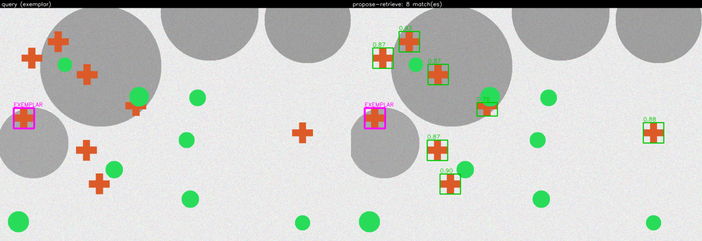
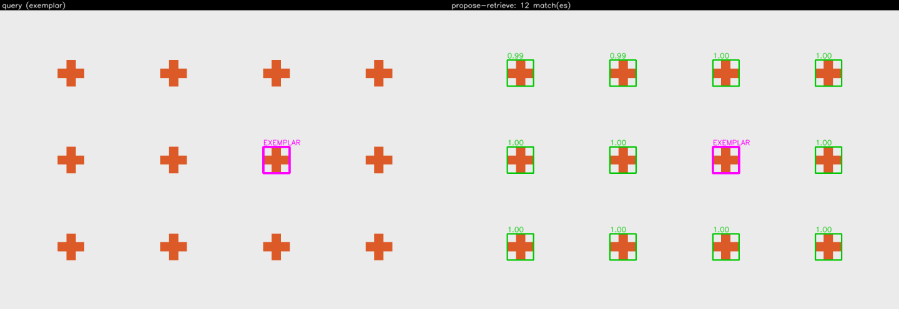
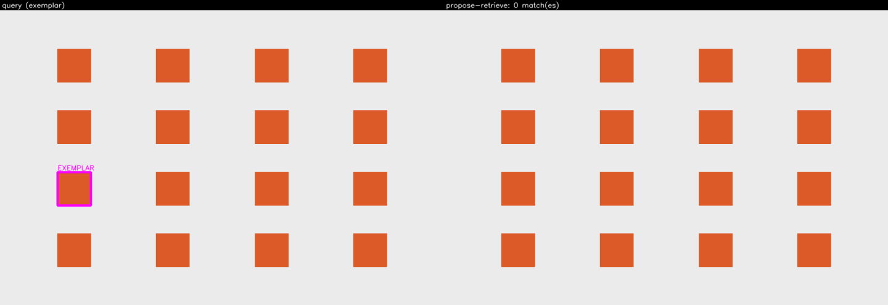
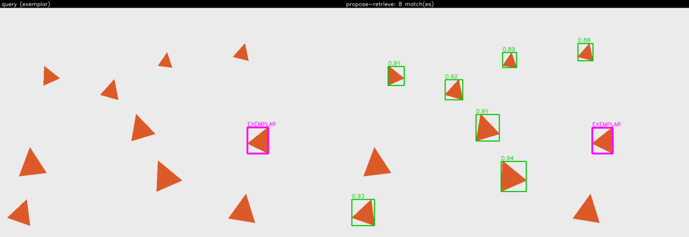

# Method 5 — `propose-retrieve` (class-agnostic proposals + DINOv2 region embeddings)

The method for "give me tight boxes around every instance". Instead of scoring a dense similarity
map (Method 3, `dino-dense`), it first asks a **class-agnostic segmenter — FastSAM in "everything
mode"** — for a few hundred region proposals, then embeds each proposed region with the **same
DINOv2 backbone as Method 3**, and ranks those regions by the **cosine similarity** of their
embedding to the exemplar's embedding. The accepted regions are the matches.

Its selling point over `dino-dense` is **boundary alignment**: FastSAM proposals hug object edges,
so the returned boxes are tight rectangles around real objects instead of the blobby connected
components a stride-14 similarity map produces. That is not an impression — it is a **measured
number**: a test asserts the mean IoU of the returned boxes against the exact chipset ground truth
is above `0.70` (it measures ~`0.99` on the 1600×1200 chipset), which is Phase 7 success criterion 1.

The module `src/object_search/search/propose_retrieve.py` is meant to be read top to bottom; the
numbered steps below match the `# 1.` … `# 7.` comments in `search()` one-for-one (METHOD-11).

## The two independently callable units — the Milestone 2 seam

This is the defining constraint of Phase 7, and the reason Milestone 2 (marker-conditioned
proposals) can **add an exploration rather than fork the app**:

- **`propose(image, config) -> list[Proposal]`** — the proposal stage (built in plan 07-01, in
  `search/proposals.py`).
- **`embed_regions(image, boxes, config) -> NDArray`** — the embedding stage, built here: one
  L2-normalized embedding per box. It knows **nothing** about proposals, exemplars, or retrieval.

`search()` **composes** the two and does nothing they cannot do alone. Neither unit reaches into the
other's internals, and a **seam test calls each directly**, not through `search()` (Phase 7 success
criterion 2).

## One DINOv2 model, shared with Method 3

The embedding stage deliberately reuses Method 3's module-level `DINOv2Inferencer` singleton
(`dino_dense._get_inferencer`) rather than constructing a second one — **one model download, one
preprocessing contract** (CONTEXT locked decision 6). There is structurally no second DINOv2 loader
in the codebase, and a test asserts `embed_regions` routes through that one singleton and that the
registry holds exactly one `dinov2-*` key (Phase 7 success criterion 3).

## Algorithm

### 1. Propose regions (FastSAM everything-mode)

`propose(image, FastSAMConfig(conf_thres=config.proposal_conf))` returns class-agnostic region
proposals. FastSAM's internal box NMS is deliberately **loose** (`iou_thres=0.9`): "everything
mode" *wants* overlapping proposals, because a missed object cannot be recovered later while a
duplicate can. Over-segmentation is collapsed by a **second** NMS after retrieval (step 6), not
here.

### 2. Embed the proposal regions

`embed_regions(image, [p.box for p in proposals], config)` → an `(N, D)` matrix, one **L2-normalized**
DINOv2 embedding per proposal. Each box is cropped from the scene, embedded on its own, its patch
tokens **mean-pooled**, then the whole matrix is L2-normalized row-wise.

### 3. Embed the exemplar

`embed_regions(image, [exemplar.box], config)[0]` → the `(D,)` exemplar embedding, through the
**same unit and the same backbone** as step 2. The exemplar is part of the scene, so its own region
usually appears among the proposals and scores ~`1.0` against itself — which anchors the calibrator
in step 5.

### 4. Cosine nearest-neighbour — a plain NumPy matmul (no FAISS)

`scores = proposal_embeddings @ exemplar_embedding`. Because both sides are already L2-normalized,
the dot product **is** cosine similarity in `[-1, 1]`. This is a **plain NumPy matmul — FAISS is
deliberately not adopted** (CONTEXT decision 7): for a few hundred proposals in one image a FAISS
index is pure dependency cost. The embedding matrix is shaped `(N, D)` precisely so a FAISS index
slots in unchanged when corpus-scale search arrives (backlog).

### 5. Calibrate the threshold

A fixed `retrieval_threshold` passes straight through; otherwise `common.calibration.calibrate`
fits a two-mode `gmm` and cuts between the "matches" mode (the exemplar's own region and its
duplicates near `1.0`) and the background mode. **Absolute cosine thresholds do not transfer across
images** for deep features, which is exactly what the calibration layer is for. On a homogeneous
proposal set the `gmm` degeneracy guard falls back to `ratio`, reporting the fallback in its
`reason`. The calibrator returns its **reasoning**, which becomes an inspectable diagnostics note.

### 6. Split into matches and candidates, then post-retrieval NMS

Proposals clearing the threshold are accepted; the top `max_candidates` by raw score are retained as
sub-threshold `Candidate`s regardless of the threshold (EVAL-08), so an offline sweep can rebuild a
PR curve. The accepted set is then run through **post-retrieval NMS at `nms_iou`** to **collapse SAM
over-segmentation** — one object that FastSAM split into several overlapping proposals, each of which
embeds well, would otherwise surface as duplicate detections. The pre-NMS proposal count and the
number collapsed are recorded in diagnostics so the over-segmentation is **visible, not hidden**.
**METHOD-12: every accepted region survives NMS — there is no single-best / argmax short-circuit.**
The kept proposal overlapping the exemplar box is labelled `is_exemplar=True` rather than dropped or
double-counted (METHOD-04c).

### 7. Diagnostics and the latency split

`Diagnostics` carries the **full proposal set** as `proposals` (the UI's debug overlay, Phase 7
success criterion 4) plus `metrics` (threshold, proposal/accepted/match counts, `collapsed_by_nms`,
score max/mean). `LatencyBreakdown.inference_ms` carries the summed model time, but the metrics
report **`proposal_ms` and `embedding_ms` as distinct numbers** and a note states which dominates —
because **the proposal stage dominates**, and that is the whole point of the EVAL-11 breakdown
(measured ~200 ms proposal vs ~45 ms embedding on the 1600×1200 chipset). A run that clears nothing
returns `outcome=EMPTY` with a note; an absent weight returns `outcome=ERROR` with a
`model_unavailable` note — never a silent empty and never a raise (METHOD-04c).

## Pre-processing (exact)

Neither backbone's preprocessing is re-derived here; both are written down once in their inferencer
docstrings and reused verbatim.

**FastSAM proposals** (`FastSAMInferencer`): input `images`, f32, NCHW, **RGB**; scale `1/255`,
**NO mean subtraction, NO std division** (YOLO does no normalization); resize **letterbox** to
1024×1024 by `min(1024/W, 1024/H)`, padded with **fill 114** (the YOLO grey), centred — so the pad
is subtracted when mapping boxes back. Output decoding (YOLOv8-seg, verified at 1024²/640²/512×768):
transpose `output0` `[1, 37, anchors]` → `[anchors, 37]`; split into `[0:4]` box `(cx,cy,w,h)`,
`[4]` objectness, `[5:37]` 32 mask coeffs; confidence-filter at `conf_thres`; convert to `xyxy`;
box **NMS** at `iou_thres` with deterministic `(-score, y1, x1)` tie-break; undo the letterbox.
Masks are decoded only when requested (`sigmoid(coeff @ protos)`, reshaped, then **cropped to each
box** — mandatory, or the prototype-combination mask bleeds outside the detection); Milestone 1 uses
boxes only.

**DINOv2 region embeddings** (`DINOv2Inferencer`, shared with Method 3): input `pixel_values`, f32,
NCHW, **RGB**; scale `1/255`, mean `[0.485, 0.456, 0.406]`, std `[0.229, 0.224, 0.225]`; **bicubic**
resize with **snap-to-multiple(14)** and **NO centre-crop**; CLS and any register tokens stripped by
a *derived* `[1 + n_register:]` slice (`n_register = 0` for `dinov2-small`, derived not hardcoded).
A proposal crop smaller than one 14 px patch is up-sized to 14×14 first, so a small proposal still
yields a token.

## Post-processing (exact)

- **Mean-pool then L2-normalize**, in that order, per region — the region embedding is the mean of
  its patch tokens, normalized *once* so its self-cosine is `1.0`. Normalizing per token before
  pooling weights every token equally regardless of magnitude — a different, wrong quantity (the
  same DINOv2 high-norm-artifact trap Method 3 documents).
- **Cosine NN is a plain NumPy matmul — no FAISS** (step 4).
- **Calibrate the threshold** (`gmm` default, or fixed `retrieval_threshold`); absolute cosine cuts
  do not transfer across images — step 5.
- **Post-retrieval NMS at `nms_iou`** collapses SAM over-segmentation; the proposal count is in
  diagnostics — step 6.
- **Retain sub-threshold candidates** (EVAL-08); return every accepted region after NMS (METHOD-12)
  — step 6.

## Config reference

Generated from `ProposeRetrieveConfig`'s JSON Schema — the same schema that drives the UI form — so
it cannot drift from the code.

| field | default | effect |
| --- | --- | --- |
| `proposal_backend` | `"fastsam"` | Which class-agnostic proposal backend to use. Only `fastsam` is implemented in Milestone 1; MobileSAM is a documented deviation (its ONNX decoder takes one prompt per call, so everything-mode is ~1024 calls plus a ported mask generator). |
| `proposal_conf` | `0.4` | FastSAM objectness threshold: keep proposals whose class-0 confidence exceeds this. FastSAM's default is 0.4. Lower surfaces more (and smaller) regions. |
| `retrieval_threshold` | `null` | Fixed accept threshold on the cosine similarity between a proposal embedding and the exemplar embedding. `null` ⇒ calibrate with a two-mode gmm (absolute cosine cuts do not transfer across images for deep features). |
| `nms_iou` | `0.5` | Post-retrieval NMS IoU. A later accepted box overlapping a kept one by MORE than this is suppressed — this is what collapses FastSAM over-segmentation (one object split into several proposals) into a single detection. |
| `max_candidates` | `50` | How many top-scoring proposals (with raw scores) to keep as sub-threshold candidates for an offline PR sweep (EVAL-08), regardless of the threshold. |
| `seed` | `0` | `random_state` for the gmm calibrator (its only genuinely stochastic step). |

## Licence — FastSAM is AGPL-3.0 (a real sharing constraint, stated plainly)

FastSAM is **AGPL-3.0**, and the exported `.onnx` file **itself embeds that licence string**. The
export-time-only isolation (Ultralytics lives only in the `export` pixi env, so the runtime
dependency graph stays torch-free) protects the *dependency graph* but **not the weights**. Private
local use triggers nothing; **publishing this repo or network-exposing the FastAPI app fires
AGPL §13.** This is recorded in three places — `assets/demo/LICENSES.md`, the `fastsam-s`
`ModelSpec.license_note`, and here — because it is a real constraint on how the repo may later be
shared, not a footnote. Revisit before publishing or exposing the app.

## Deviation — MobileSAM is not implemented as a working second backend

The brief imagined a FastSAM/MobileSAM switch. **MobileSAM is not implemented as a working second
backend in Milestone 1, and this is a documented deviation** (CONTEXT locked decision 5). The reason,
from research: the ONNX SAM decoder accepts **one prompt per call**, so "everything mode" means a
32×32 grid ⇒ **~1024 sequential decoder calls** plus a hand-ported `SamAutomaticMaskGenerator`. That
is a *phase of work, not a backend swap*. What ships instead is a `ProposalBackend` protocol with
FastSAM as the single implementation, so MobileSAM can be added later **without restructuring** — the
seam is open, the work is deferred. (IDEA.md §14's `awarebayes/MobileSamONNX` reference was also
dropped, verdict **HOLD**: 0 stars, a 4-day project untouched for 14 months, single author, while
first-party export scripts and a better-provenanced MIT artifact both exist.)

## Known failure modes

- **SAM over-segmentation.** One object becomes several proposals; each embeds well, so without the
  post-retrieval NMS they surface as duplicate detections. NMS at `nms_iou` collapses them, and the
  pre-NMS proposal count in diagnostics is how the practitioner sees it happening. This is the
  expected failure mode and the tuning signal — **the chipset (exact ground truth) is where you tune
  it.**
- **The raw box crop includes background.** A tight box around a non-convex object still embeds some
  surrounding pixels; the FastSAM mask is available (`return_masks`) to mask that background out — a
  cheap, likely-real win deferred to the backlog.
- **Latency is dominated by the proposal stage.** This is a *finding*, not a defect — see the EVAL-11
  latency split; it is why the breakdown attributes proposal and embedding time separately.
- **AGPL / non-commercial licence constraints.** The FastSAM weights carry AGPL-3.0 (above); this
  constrains sharing, not local exploration.
- **Weights absent.** With FastSAM or DINOv2 absent the method returns `outcome=error` with a
  `model_unavailable` note rather than raising.

## ROBUSTNESS BACKLOG

Deferred deliberately (mirrored verbatim from the module docstring and
`docs/ROBUSTNESS-BACKLOG.md`); none is built in this phase:

- **FAISS index for corpus-scale retrieval** — unnecessary for a few hundred proposals in one image;
  the `(N, D)` embedding matrix is shaped so it slots in when corpus search arrives.
- **Background-masked region embedding** — embed the FastSAM mask interior rather than the raw box
  crop; the mask is already produced, so this is cheap and likely a real accuracy win.
- **Proposal filtering by an exemplar size/aspect prior** — drop proposals whose shape cannot match
  the exemplar before embedding, cutting both cost and false positives.
- **Multi-crop / test-time augmentation embeddings** for pose-robust region descriptors.
- **Alternative proposal sources (RPN, selective search)** for images where SAM over-segments.
- **MobileSAM everything-mode** with a ported `SamAutomaticMaskGenerator` as a second backend.

## Sample runs

Regenerated by `pixi run samples` and committed under
[`docs/samples/propose-retrieve/`](../samples/propose-retrieve/) (see its
[`index.md`](../samples/propose-retrieve/index.md) for the per-image outcome table). Each panel
shows the query and the matches overlay; the proposal set is the diagnostics overlay in the app.

| image | panel |
| --- | --- |
| `cluttered-distractors` — tight boxes amid clutter |  |
| `lattice-plain` — repeated instances on a plain lattice |  |
| `lattice-touching` — touching instances (where NMS earns its keep) |  |
| `scatter-scaled` — scale + pose variation |  |

## Pseudocode

**Method ④ propose-retrieve** — fourth of the four *implemented* methods (implementation
numbering ①–④: `ncc`, `sparse-geo`, `dino-dense`, `propose-retrieve`; source-research numbering
1, 2, 3, 5, with research Methods 4 and 6 deferred — this is research **Method 5**). The steps
below mirror the `# 1.` … `# 7.` comments in `search()` (METHOD-11); read
`src/object_search/search/propose_retrieve.py` for the ground truth.

```
1. proposals <- propose(image, FastSAMConfig(conf_thres=proposal_conf))  # FastSAM everything-mode
   (internal box NMS is deliberately LOOSE, iou_thres=0.9: wants overlapping proposals)

2. proposal_embeddings <- embed_regions(image, [p.box for p in proposals])  # (N, D)
   (crop each box, DINOv2 mean-pool its patch tokens, row-wise L2-normalize)

3. exemplar_embedding <- embed_regions(image, [exemplar.box])[0]  # (D,)
   (SAME unit, SAME shared DINOv2 backbone as step 2)

4. scores = proposal_embeddings @ exemplar_embedding  # cosine NN, a plain NumPy matmul (no FAISS)

5. calibrate the threshold:
       fixed retrieval_threshold passes straight through, OR
       two-mode gmm cuts between the "matches" mode (~1.0) and background (ratio fallback if degenerate)

6. proposals with score >= threshold -> accepted; keep top max_candidates as Candidates (EVAL-08)
   POST-RETRIEVAL NMS at nms_iou over the accepted set  # collapses SAM over-segmentation
   label the kept proposal overlapping the exemplar box is_exemplar=True  # METHOD-12: no single-best

7. Diagnostics carry the FULL proposal set + metrics (proposal_ms vs embedding_ms, collapsed_by_nms)
   EMPTY-with-note if nothing clears; ERROR model_unavailable if a weight is absent (never a raise)
```

## References

- Zhao et al., "Fast Segment Anything", 2023: https://arxiv.org/abs/2306.12156
- FastSAM code: https://github.com/CASIA-IVA-Lab/FastSAM
- Kirillov et al., "Segment Anything (SAM)", 2023: https://arxiv.org/abs/2304.02643
- Oquab et al., "DINOv2", 2023 (region embeddings): https://arxiv.org/abs/2304.07193
