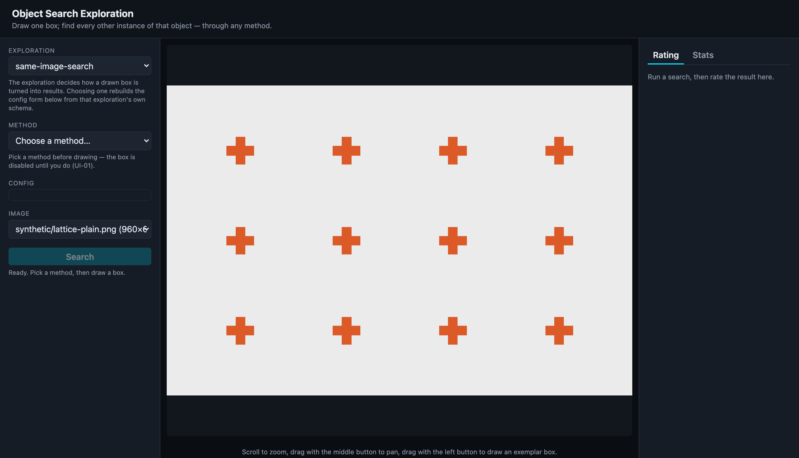
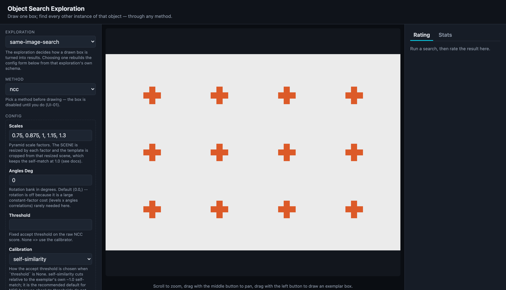
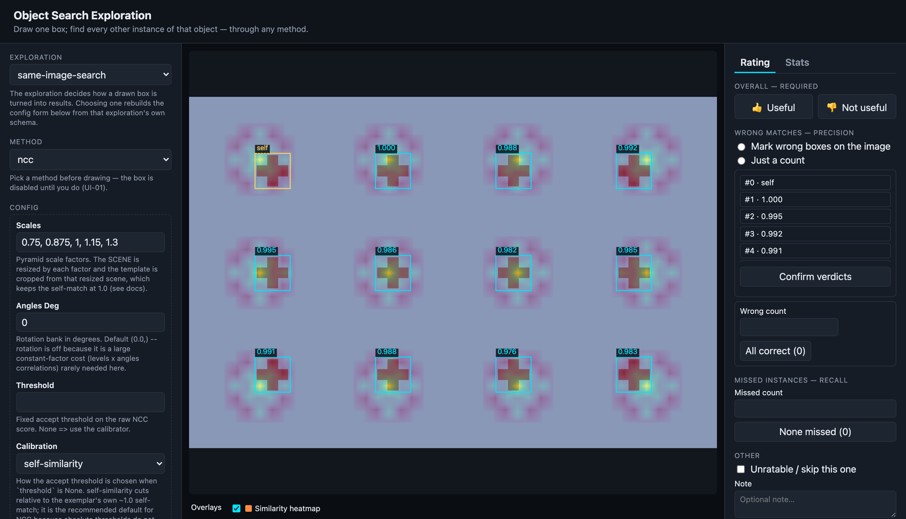
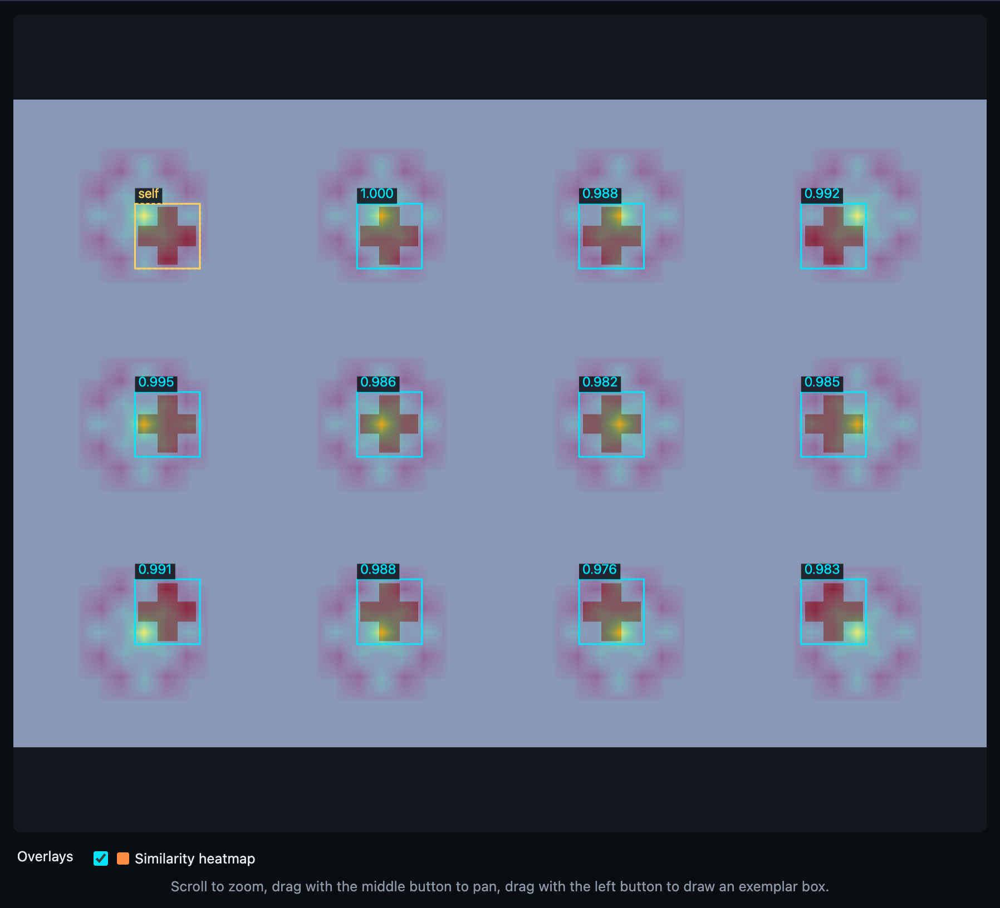

# Interface walkthrough

This is the app end to end: pick a search method, draw one box around an object, and every
other instance of that object in the *same image* is found and drawn back with a diagnostics
overlay. The screenshots below are captured from the real running UI (`pixi run serve`) — see
[Reproducing these screenshots](#reproducing-these-screenshots) at the bottom.

The demo scene throughout is `synthetic/lattice-plain.png` — twelve identical crosses — run
through the zero-model [`ncc`](methods/ncc.md) method.

## The layout

The window is three columns: a **control rail** on the left, the **canvas stage** in the
middle, and a **rating / stats panel** on the right.



- **Exploration** (top of the rail) decides *how* a drawn box becomes results. The default,
  `same-image-search`, is Milestone 1's "find every other instance" mode; `marker-conditioned`
  is the [Milestone 2 exploration](explorations/marker-conditioned.md). Choosing an exploration
  rebuilds the config form below it.
- **Method** picks which of the five algorithms runs. This is chosen *before* drawing on
  purpose — the same box can then be re-run through different methods and compared.
- The canvas shows the current image. **Drawing is disabled until a method is picked** (the
  UI-01 gate) — note the status line reads *"Ready. Pick a method, then draw a box."*

## 1 · Pick a method

Selecting a method rebuilds the **Config** form directly from that method's schema — one source
of truth for defaults, ranges, and help text. Here `ncc` exposes its pyramid `Scales`, an
optional rotation bank (`Angles Deg`), an accept `Threshold`, and the `Calibration` strategy.



Once a method is chosen (and an image is loaded), the canvas is armed for drawing — the cursor
becomes a crosshair.

!!! tip "Changing the image"
    The **Image** dropdown lists the demo set from `assets/demo/` (with each image's
    dimensions). Ground-truthed images also feed the objective [benchmark](benchmark/results.md).

## 2 · Draw the exemplar box

Drag with the **left mouse button** across one instance to draw the exemplar box. A live
rubber-band follows the cursor; on release, the box is finalized in image pixels and the search
runs automatically (there is also a **Search** button to re-run the current box).

- **Scroll** to zoom, **middle-button drag** to pan — the box you draw is always recorded in the
  image's own pixels regardless of zoom or pan, so results line up exactly.
- A box smaller than 8×8 image pixels is rejected as a stray click.

## 3 · Read the results and diagnostics

The matches are drawn back on the image: a cyan box per found instance with its match score, the
exemplar itself labelled **`self`**. For twelve identical crosses, `ncc` finds all twelve.



The real value is the **diagnostics overlay** — how you see *why* a method did what it did, not
just *that* it did it. Each method returns its own diagnostics, and the overlay toggles below the
canvas are built from whichever fields are present in the result (never hard-coded per method).
For `ncc` that is the **similarity heatmap**: the `TM_CCOEFF_NORMED` response over the whole
scene, bright at each cross centre.



Toggle each overlay on and off with the checkboxes in the **Overlays** legend. Other methods
surface different diagnostics — keypoint correspondences and Hough peaks for
[`sparse-geo`](methods/sparse-geo.md), region proposals for
[`propose-retrieve`](methods/propose-retrieve.md), and so on.

## 4 · Rate the run

The right panel records how well the method did on *this* query — the subjective half of the
evidence the [scoreboard](benchmark/results.md) is built from.

- **Overall** (required): a single 👍 / 👎 on whether the result was useful.
- **Wrong matches — precision**: either mark individual wrong boxes directly on the image
  ("Mark wrong boxes on the image", then click each bad box) or enter a plain count.
- **Missed instances — recall**: how many true instances the method failed to find.

!!! warning "Counts are stored empty, never zero"
    `wrong_count` and `missed_count` are left **null** until you assess them — `null` means "not
    reviewed", `0` means "reviewed, none wrong/missed". Precision and recall are derived in
    queries from these fields, so an unreviewed run never claims a perfect score.

## 5 · The stats scoreboard

The **Stats** tab turns accumulated ratings — plus the objective precision/recall on
ground-truthed images — into a per-method scoreboard, so you can say which method actually works,
on which kind of image, and at what latency. The committed benchmark on the demo set lives in
[Benchmark results](benchmark/results.md).

## Reproducing these screenshots

The images above are not hand-taken — they are captured deterministically by a Playwright script
that drives the real UI (selects the method, drives the exact pointer drag the canvas listens
for, waits for the overlay, and writes the PNGs into `docs/assets/ui/`). To regenerate them:

```bash
pixi run serve                          # terminal 1: app on http://localhost:8000
pixi run -e capture playwright-install  # once: fetch the Chromium binary
pixi run -e capture capture-ui          # terminal 2: re-capture the walkthrough shots
```

The script (`scripts/capture_ui.py`) pins a model-free query (`ncc` on the ground-truthed lattice)
so the result is identical every run.
